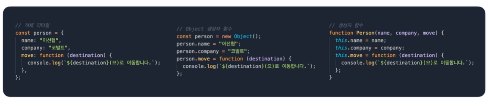

## 객체지향과 프로토타입
#### 객체지향의 객체란?
  
  
현실 버튼과 웹 사이트 버튼의 차이는???  
* ### 현실 버튼
  * 튀어나와 있다.
  * 누르면 무언가 발생한다
  * 실제로 만질 수 있다
  * 스프링이 필요하다
  * 색을 입힐 수 있다 등
* ### 웹 사이트 버튼
  * 튀어나와 있다.
  * 누르면 무언가 발생한다.
  * 색을 입힐 수 있다. 등등
  
## 객체지향의 객체는 현실에 있는 것을 추상화한 것
현실에 존재하는 것을 코드로 옮기는 것이 아니다!  
  
## 추상이란?
  
  
#### 실제 지구, 지도, 지구본은 무슨 차이가 있을까??  
가운데 지도는 직사각형으로 표현되기 때문에 직관적으로 볼 수 있다.  
그리고 위도와 경도를 정확하게 표현할 수 있다.  
하지만 이 지도는 실제를 **왜곡**하고 있다.  
아프리카 대륙은 미국,중국, 인도등 여러 나라가 들어가고도 남을 만큼 크다.  
하지만 실제 크기가 왜곡되여 작게 보인다.  
반면에 지구본은 한눈에 보기에는 어려움이 있지만 실제 크기를 그대로 반영하고 있다.  
  
### 추상이란 사물이 지니고 있는 여러 측면 중 특정한 부분만 보는 것  
그 외에 필요없는 부분은 전부 버린다!  
  
## 객체지향이란?
* 객체 위주로 설계하고 프로그래밍하는 패러다임
* 객체지향 언어에선 추상화의 최소 단위가 객체다.
* 각각의 객체는 메세지를 주고받을 수 있다.  

  
  
## 객체지향의 오해1
* 객체지향은 패러다임일 뿐 언어와는 관계 없다.
* 언어는 지향하는 것을 조금 더 편하게 구현할 수 있게 도와줄 뿐이다.
* 따라서 클래스가 없는 Javascript, Go, C 언어로도 객체지향 프로그래밍을 할 수 있다.
* 자바스크립트는 프로토타입을 통해 객체지향을 표현한다.  
  
```
본래 JavaScript엔 타언어에 있는 클래스라는 개념이 없었습니다.
ES6를 거쳐 지금은 클래스라는 개념이 존재하는데요, 
아직까지는 prototype의 syntactic sugar 정도입니다. 
따라서 타언어의 클래스와 완전히 동일하지는 않습니다. 
추후 기능이 더 강화되어 prototype과 다른 개념이 될 수는 있지만 아직까진 prototype 기반이라고 생각하시면 됩니다.
```  
  

## 객체지향의 오해2
* 절차지향보다 객체지향이 무조건 더 좋은 것은 아니다
* 만들어야하는 프로그램에 따라 절차지향이 더 적합할 수 있다.
  * 비교적 간단한 프로그램일 수록 절차지향이 더 만들기 쉽고 직관적이다.
* 객체지향은 객체간 통신하기 때문에 흐름이 더 직관적이서 더 복잡한 프로그램에 적합하다.
  

## 프로토타입
  
  
## 자바스크립트의 객체
클래스 기반 언어처럼 속성(Attribute)과 행위(Method)를 정의할 수 있다.  

    
  
## 객체 생성 방법  
객체 리터럴, Object, 생성자 함수 세가지 방법을 이용할 수 있다.  

  

  
  
좌측 코드를 보면 `Person`에 name 과 company를 정의하고 이름을 반환하고 설정하는 메소드를 설정합니다.  
이렇게 Person의 생성자 함수를 통해 2개의 객체를 만들고 출력해보면  
두 객체 모두 메소드가 따로 정의가 되어있는 것을 확인할 수 있다.  
때문에 같은 역할을 하는 메소드 이지만 별도로 생성되어졌기 때문에 메모리 낭비가 발생할 수도 있습니다.  
  
## 프로토타입
기존의 객체를 복사하여 새로운 객체를 생성하는 방식  

  
  
  
기존에 있던 함수를 Person의 Prototype 객체 안에 추가하였다.  
이렇게 설정하고 객체를 생성하면 하위 객체들은 상위 객체를 바라보게된다.  
객체들은 각자 프로토라는 객체를 내부적으로 가지고 있는데  
이 프로토 객체에서 상위 객체를 바라보게 된다.  
이런식으로 프로토타입은 기존 객체를 효율적으로 사용할 수 있는 방법이라 할 수 있습니다.  
  
## Effective Prototype
부모 객체를 이용하여 프로토타입 함수 정의하기  

### 상속 흉내내기 - 1
  

상속 받을 객체의 생성자 함수를 만든 후 해당 생성자 함수의 프로토타입에 상속받을 객체를 대입한다.  
이러면 상속할 객체가 연결되어 그대로 이용할 수 있다.  
하지마 이런경우는 상속받는 객체는 상속객체의 내부 변수에 접근할 수 없다.

### 상속 흉내내기 - 2
  
이런 경우는 apply 함수 또는 call 함수를 통해서 부모 생성자 함수를 이용할 수 있습니다.  
```
call()와 apply() 함수들은 bind() 함수처럼 
만약 객체1에서 객체2의 함수를 빌려 쓰고 싶을 때 쓸 수 있다. (상속 없이)
두 함수의 차이점은 call()는 여러 인자를 나열해서 받고 apply()는 여러 인자를 한 배열에 받는다.

두 함수 모두 첫 인자는 this를 가리킬 객체를 받는다.

const bank = {
    deposit: function(amount) {
        this.money += amount;
    },
    deposits: function(amountOne, amountTwo) {
        this.money += amountOne + amountTwo;
    }
};
 
const john = {
    money: 0
};
 
bank.deposit.call(john, 100);
console.log(john.money)
 
bank.deposits.apply(john, [200,300]);
console.log(john.money)
```  
  
### Object.create
기존 객체를 재활용할 수 있다.  
  


