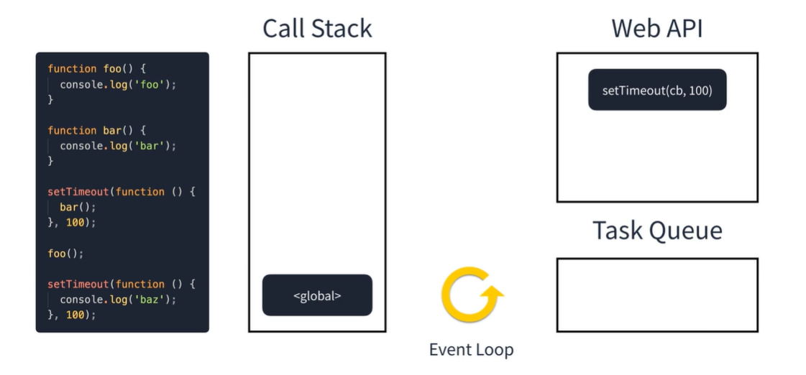

## 이벤트 루프
#### Javascript는 Single Thread로 작동한!  
  

Javascript의 Call Stack 은 하나만 존재한다.  
그러면 어떻게 브라우저에서 실행되는 Javascript는 어떻게 비동기적으로 데이터를 불러오고 애니메이션을 실행 시키는 것일까?  
어떻게 애니메이션과 클릭이벤트를 동시에 처리할 수 있는 것일까??  

  
  
### 그것인 Event Loop 라는 시스템이 있기 때문이다.  
Event Loop 는 Javascript의 기능이 아닌 Browser 나 Node 에서 자체적으로 관리하고 있다.  
우측 상단의 `Web API`는 Browser 에서 제공하는 API 이다.  
클릭과 같은 DOM event 나 네트워크 호출 Timer 등을 실행시킬 경우 해당 업무가 Browser 에게 위임됩니다.  
보통 이런 WEB API는 `CALL BACK` 함수를 전달하게 되는데  
이 CALL BACK 함수는 비동기 작업이 끝나면 `Task Queue` 에 넣어져 순차적으로 꺼내 `Call Stack` 에 push 됩니다.  
따라서 이런 일련의 과정들은 멀티 쓰레드로 동작합니다.  
Javascript Engine 이 Single Thread 일뿐 Browser 는 Multi Thread로 동작하기 때문에 이러한 과정들이 가능하다.  
  
## Event Loop의 동작 과정  
  
먼저 Script 가 실행되면 전역 스크포내에서 실행 됩니다.
  
  
코드가 순차적으로 실행되어 setTimeout 함수가 Call Stack 에 push 되고  
해당 작업을 Web API 에게 위임합니다.
  
  
  
다음으로 foo 함수가 Call Stack 에 push 됩니다.  
foo 함수 내에 있는 console.log 가 Call Stack push 됩니다.  
console.log 가 실행된후 Call Stack 에서 제거됩니다.  

  
  
foo 함수의 로직이 종료 되었기 때문에 Call Stack에서 제거된다.  

  
  
마지막 setTimeout 이 Call Stack push 되고 해당 작업을 WEB API 에게 위임합니다.  
또한 스크립트의 모든 로직이 종료되었기 때문에 global scope 도 Call Stack에서 제거된다.

  
  
  
실행된 WEB API 인 setTimeout은 시간이 지나면 비동기 콜백을 Task Queue에 넣습니다.
  

이때 Task Queue 에 들어간 Call Back 함수는 Call Stack이 비어있을때 쌓입니다.  
이것을 틱 이라고 부릅니다.
  
  
Task Queue에 있는 두번째 Call Back은 Call Stack이 비어있지 않기 때문에 그대로 남아 있습니다.  

  
  

Call Stack 에 있는 작업들이 모두 실행되고 난 후에 Task Queue에 있는 작업을 다시 Call Stack으로 push 합니다.  

  
  

