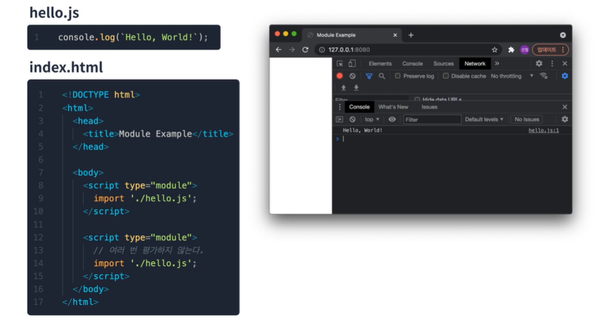

## 모듈
일반적으로 웹사이트는 여러개의 Javascript 로 이루어져 있다.  
`대부분 script 언어의 특징이지만 Javascript는 파일들을 각각 별개의 프로그램으로 취급합니다.`  
문제는 웹사이트가 점점 하는 일이 많아짐에 따라 script 파일도 크게 증가하게 되었다는 것이다.
    
  
  
일단 Javascript 는 script 파일들 간의 통신을 위해 전연스코프에 존재하는 변수 함수를 사용해야만 했다.  
즉시 실행함수를 통해 전역스코프가 어느정도 오염되는 것을 막을 수 있었지만  
script 파일들간의 의존도를 확인하기가 힘들고 실행 순서를 제어해야한다는 한계점이 있었습니다.
    
  
위와 같은 불편한점들을 해결하고자 모듈이 등장했다.  
모듈을 사용하면 script간의 의존도를 확인할 수 있고 실행 순서를 쉽게 제어할 수 있습니다.  

    
  
## 용어 정리
* 모듈과 컴포넌트는 자주 혼용된다.
* 모듈은 설계 시점에 의미있는 요소며 컴포넌트는 런타임 시점에 의미있는 요소이다.  

    
  
## 모듈
* 왜 이름이 모듈일까?
  * Javascript는 파일 하나가 프로그램이기 떄문에 모듈이라 지었을 것이라 추측
  * 설계시 용어가 혼돈되는 경우가 많다.
  * 제대로된 모듈 역할을하기 위해 디렉토리 단위를 모듈 개념에 가깝게 사용하는 경우가 많다.
* import와 export를 통해 모듈 불러오기와 내보내기를 수행할 수 있다.
  
## 준비물
* 모듈은 로컬 파일에서 작동하지 않고 HTTP 또는 HTTPS 프로토콜을 통해서만 동작한다.
* 아주 간단한 웹 서버로 http-server를 사용할 수 있다.
  * https://github.com/http-party/http-server  
  
## 기초 사용법
  
  
## 모듈의 특징 1 - 항상 use strict 로 실행된다.  
일반 적인 script는 let , var 를 생략하고 변수 선언이 가능하다.  
이런 경우 전역 스코프에 저장됩니다.

  
  
하지만 모듈은 엄격모드 이기때문에 허용되지 않습니다.
  

## 모듈의 특징 2 - 모듈레벨 스코프가 있다.
모듈은 최상위에 변수를 선언하더라도 전역스코프에 올라가지 않고 자체적으로 모듈레벨 스코프에 올라간다.  
일반 스크립트는 최상위에 선언하면 전역 스코프에 선언되어 다른 스크립트에서 참조가 가능하지만  
모듈 스코프에서는 서로 import 하지 않는 이상 참조할 수 없습니다.  

  
  
## 모듈의 특징 3 - 단 한번만 평가된다.  
  
  
위코드에서 2번 imprt 되어있지만 실행은 한번만 된다.  
  
## 모듈의 특징 4 - 지연 실행된다.  
일반 스크립트는 body 태그안에 넣으면 순서에 따라 DOM 이 생성되기전에 실행될 수 있습니다.  
하지만 모듈 스크립트는 deffer 옴션을 주지않아도 지연 실행이 가능합니다.  
따라서 DOM이 생성된 후에 실행됩니다.  
#### 사실 요즘은 Webpack 등을 이용하여 번들링한 스크립트를 불러오면 크게 type="module"을 사용할 일이 별로없다.  

  