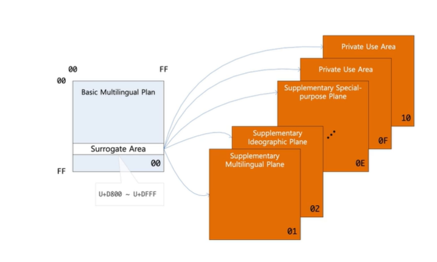

## 유니코드
웹 브라우저는 한글, 영어, 일본어등 여러 언어를 표기합니다.  
어떻게 이런것이 가능할까??  

  
  
먼저 문자가 브라우저에 그려지는 프로세스는 다음과 같다.  
값으로 이루어진 문자와 글꼴이 만나 렌더링 엔진을 통해 그려진다
  
  
## 기본 개념 - CCS(Coded Character Set)
* 문자들을 Code Point 에 대응시켜 만든 코드화된 문자들의 집합
* Code Point는 Character의 식별자가 된다.
* KS C 5601, ISO 106464, US-ASCII...  
  

  
  
## 기본개념 - CES(Character Encoding Scheme)
* CCS를 octet(8bit) 집합에 대응시키는 것
  * 8bit 인 이유는 문자를 표현하는 기본단위 이기때문이다.
* CCS 와 CES는 1:1로 대응된다.
* 흔히 말하는 인코딩에 해당한다.
  * 인코딩 - Character를 시스템이 인식할 수 있는 값으로 변환하는것  
  이변환 방법은 인코딩마다 다르기때문에 서로 호환이 안될 수 있다.
  * 디코딩 - 인코딩된 값을 다시 Character로 변환하는 것
* UTF-8, UTF-16, euc-kr, CP949....  
  
## 기본개념 - TES(Transfer Encoding Syntax)
* 인코딩한 문자가 특정 프로토콜을 타고 전송되도록 변환하는 것
* 통신 프로토콜에 제약이 있을 수 있기 때문이다.
  * 예를 들어, URL에서 공백은 사용할 수 없기에 변환을 해야한다.
* URL Encoding, BASE64 Encoding....  
  
## 유니코드
* 유니코드가 없을 때도 각 나라들은 알아서 자국 문자를 잘 표현했다.
* 하지만 다양한 나라가 **서로 다른 인코딩 방식을 사용**함으로써 호환성 및 확장성에 문제를 일으켰다.
  * 심지어 같은 문자여도 깨지는 경우가 발생했다.
* 결국 전 세계 문자를 컴퓨터에서 다룰 수 있도록 만든 표준 시스템을 만들었다.
* 대부분의 문자를 포함하여 이모티콘도 포함되어 있다.
* https://home.unicode.org/

  
  
## 유니코드 -CCS
* 코드 포인트 범위 - 0x0 ~ 0x10FFFF (1114112개 문자)
* 여기서 유니코드는 2바이트라고들 하는데 6만5천자가 넘는 문자를 관리하고 있습니다.  
유니코드가 2바이트만 사용한다는 것은 잘못된 오해로 실제로는 4바이트 영역까지 사용하고 있습니다.
* 여기서 일반적인 문자들이 속해있는 영역을 `BMP` 영역이라고 하는데 이영역을 벗어난 문자들은 자주 사용되지 않는 문자들이 담겨있습니다.
  

  

## 유니코드 -CES
* Surrogate Pair 방법 이용해 2바이트보다 큰 문자를 표현한다.  
  * Surrogate 영역에 있는 보조 문자와 BMP 외부 문자 영역을 합쳐 한글자를 표현할 수 있습니다.
  * Surrogate 문자는 BMP 영역에 있습니다.

  
  
* Code Point 가 어떤 단위로 조합되어 인코딩되는지 정의한 것  

  
  
  
* Big-Endian 과 Little-Endian 은 컴퓨터 메모리에 저장된 바이트 순서를 말한다.
* Big-Endian 은 큰 쪽에서 작은 쪽으로 정한다.
* Little-Endian 은 작은 쪽에서 큰 쪽으로 저장된다.

  
  
* BOM(Byte Order Mark)
* 문서 제일 앞에 U+FEFF 를 삽입하여 어플리케이션이 바이트 순서를 알 수 있게 해준다.

  
  
## Javascript
여기서 Javascript는 브라우저를 따라 자연스럽게 유니코드를 지원합니다.  
  
