## 정규 표현식  
  
카카오톡은 전화번호, URL, 이메일 주소를 어떻게 찾을까??  
   
## 정규표식
* 정규표현식의 목적
  * 패턴을 이용하여
    * 문자 검색(search)
    * 문자 대체(replace)
    * 문자 추출(extract)
* 성능은 ?
    * 매우 느리다! 하지만 매우 편함..
* 테스트 사이트
  * https://rubular.com/

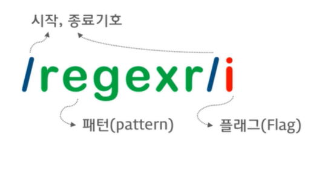  
  
## 휴대폰 번호를 찾아보자!
* 정규표현식을 사용하기 위해선 패턴을 찾는 것이 제일 중요하다.
* 휴대폰 번호의 패턴은??
  * 010-1234-5678
  * 018-123-4567
  * 01X-xxx(x)-xxxx
  * 국가번호, 안심번호 등 예외 케이스는 제외
* **세 자리 숫자, 하이픈, 셋 혹은 네 자리 숫자, 하이픈, 네자리 숫자** 패턴으로 이루어져 있다.  

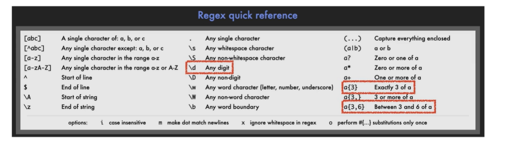  
  
**/d{3}=** 세 자리 아무 숫자  

**/d{3,4}=** 세,네 자리 아무 숫자  
  
#### 패턴을 조합해보면??

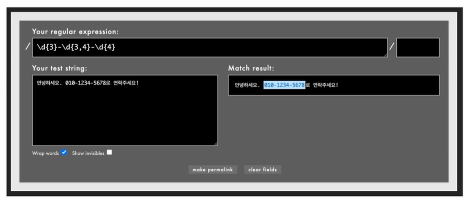  
  
## 이메일 주소에서 중간 문자열만 뽑고싶다면??
* 이메일 주소 패턴은?
  * wjdghks7878@naver.com
  * joung4342@gmail.com
* **문자열, @, 문자열, . , 문자열**패턴으로 이루어져 있다.
* 여기서 naver , gmail, 만 뽑고 싶다면??  

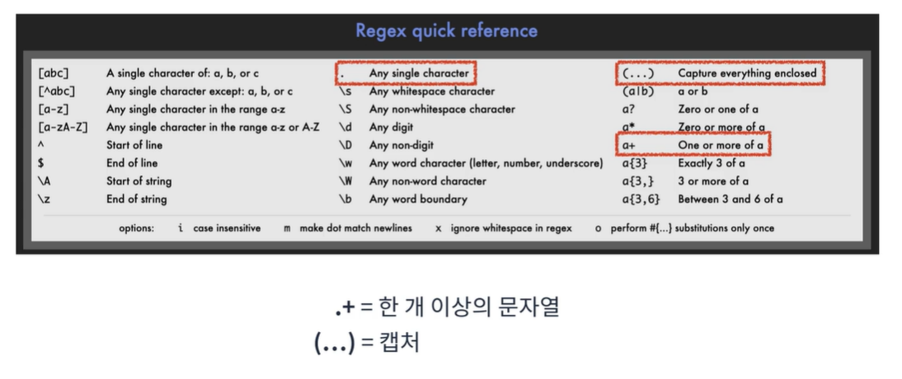  
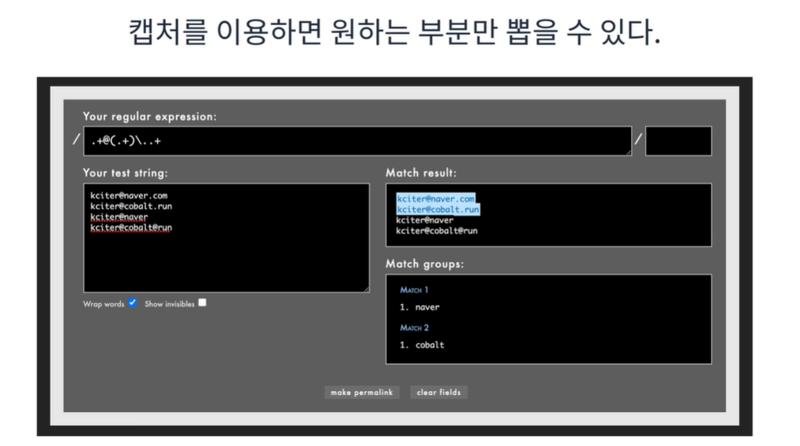  
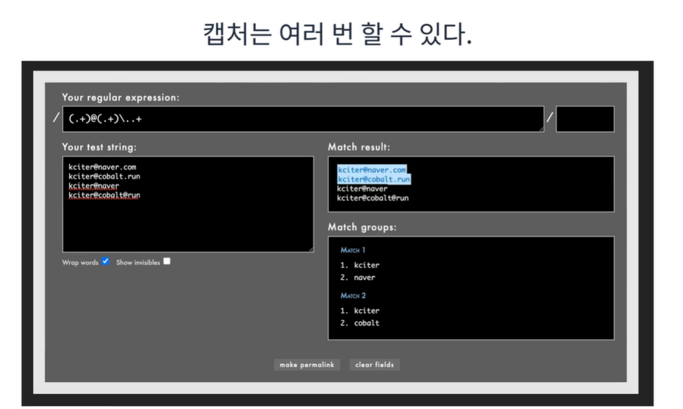  
  
#### 정규표현식 연습
https://regexone.com  
https://alf.nu/RegexGolf  
  
## Javascript  
  
## 생성 방법
Javascript 는 RegExp 객체로 정규표현식 기능을 제공한다.  
Array, Object 처럼 Literal로 생성 가능하다.  
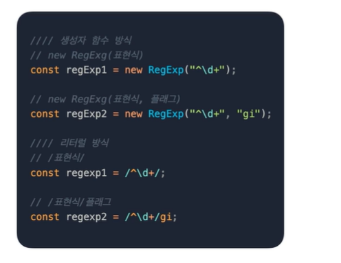  
  
  
## test
정규표현식 객체의 test함수는 입력받은 문자열에 찾는 패턴이 있는지 찾은 후  
있다면 true를 반환하고 없으면 false를 반환한다.  
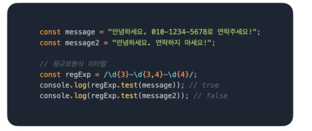  
  
## exec
정규표현식 객체의 exec 함수는 입력받은 문자열에 찾는 패턴이 있는지 찾은 후  
일치한 패턴 정보를 반환하고 없으면 null을 반환한다.  
문자 추출에 해당한다.  
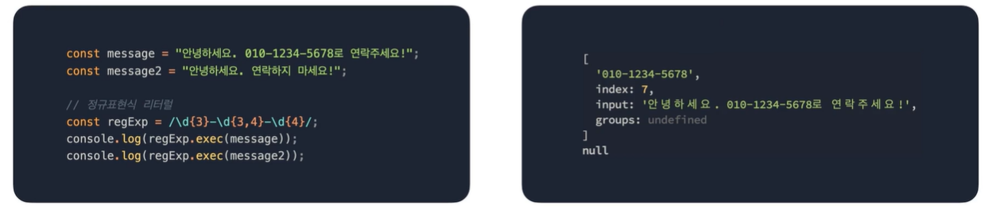  
  
  
## match
String 객체의 match 함수는 정규표현식 객체를 파라미터로 받아 패턴이 있는지 찾은 후  
일치한 패턴 정보를 반환하고 없으면 null을 반환한다. 정규표현식 객체의 exec 함수와 같다.  
문자 추출에 해당한다.  
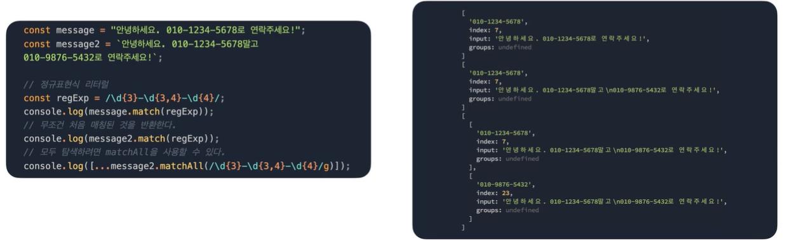  
  
## replace
String 객체의 replace 함수는 정규표현식 객체를 파라미터로 받아 패턴이 있는지 찾은 후  
일치한 패턴 정보를 원하는 문자열로 바꿀 수 있다.  
문자 대체에 해당한다.  
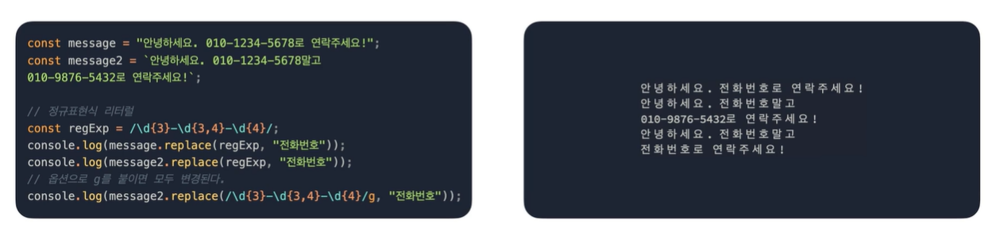  
  
## search
String 객체의 search 함수는 정규표현식 객체를 파라미터로 받아 패턴이 있는지 찾은 후  
일치한 패턴 정보의 위치를 반환한다.  
문자 검색에 해당한다.  
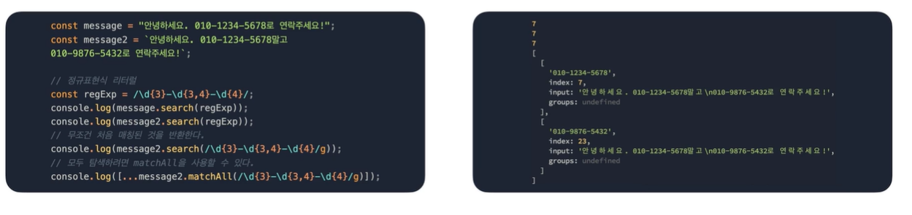  
  
## capture
캡처가 적용된 정규표현식을 이용하면 match 반환값의  
1번 인덱스부터 순차적으로 캡처의 결과가 들어간다.  
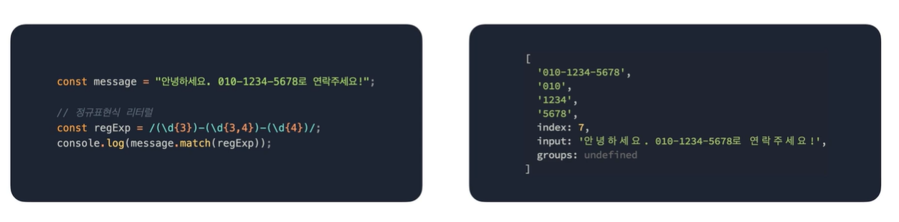  
  
## Run-length encoding
* 매우 간단한 비손실 압축 방법
* "AAAAAABBBDFFFFFFFK" 문자열을 어떻께 압축할 것인가?
* "6A3B1D7F2K"로 압축할 수 있다.
  * 6개의 A, 3개의 B, 1개의 D, 7개의 F, 2개의 K
* 패턴을 발견할 수 있는가??  

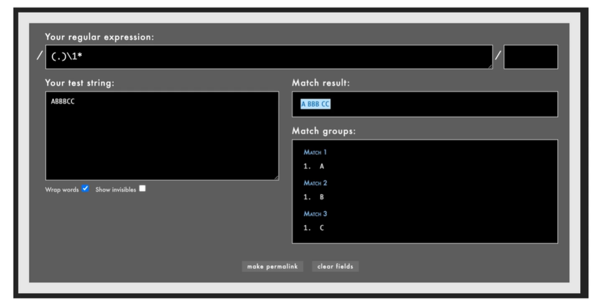  

위의 표현식 중간에 `\1`이 존재한다.  
이것은 첫번째 캡처를 이용하겠다는 의미이다.  
그래서 첫문자열을 캡처하고 캡처된 문자열이 0개이상 있는지 패턴으로 확인한다.  
결과적으로 각각 `A`, `B`, `C`로 그룹화 된것을 볼 수 있다.  
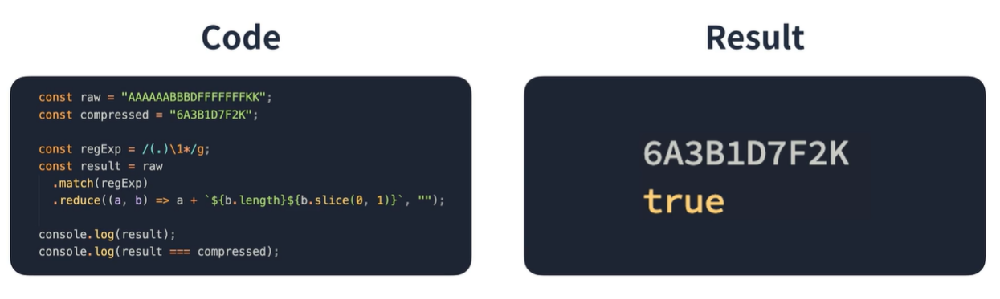  
  

  

  

