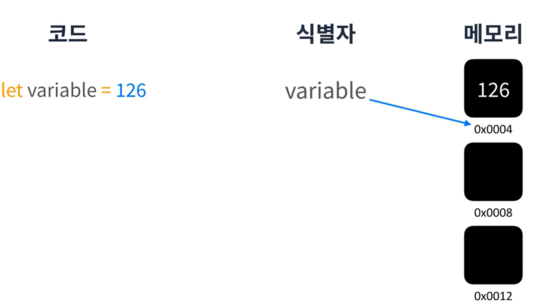
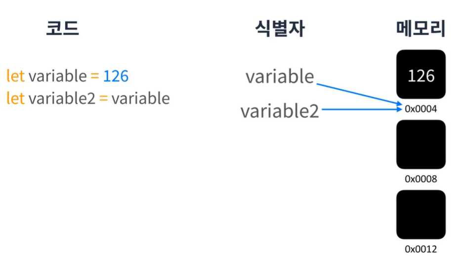
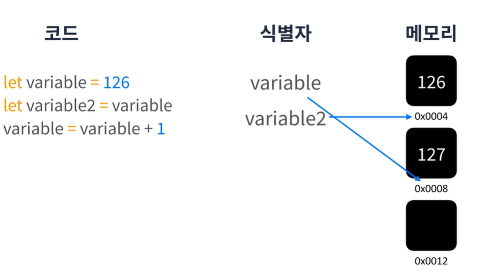
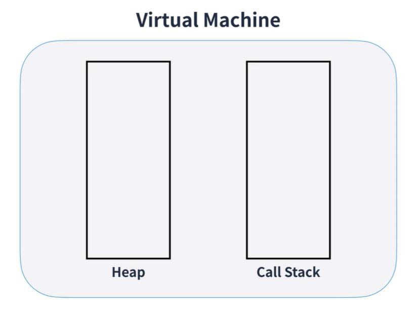
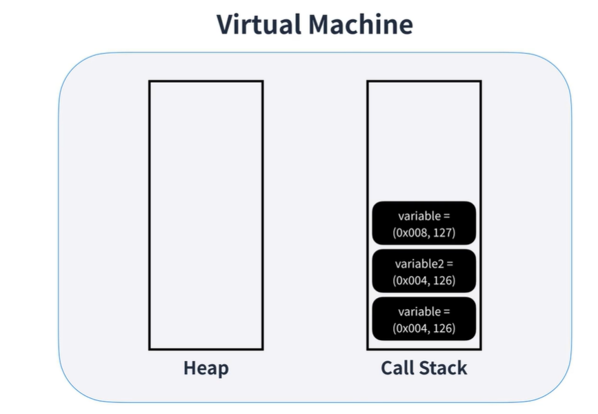
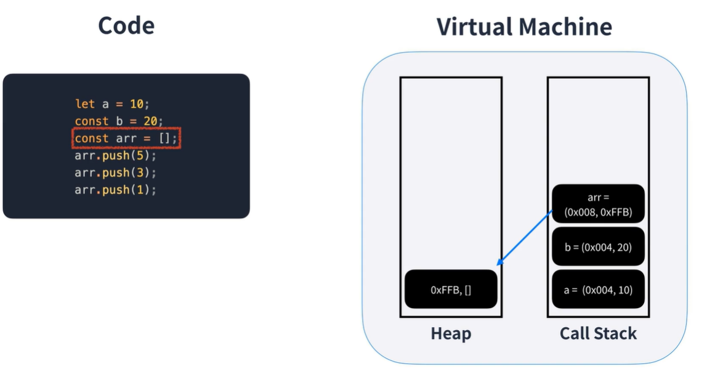
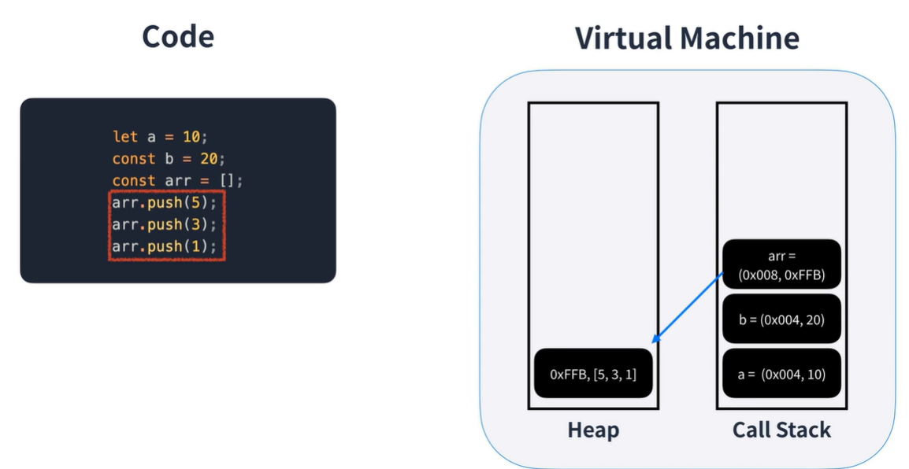
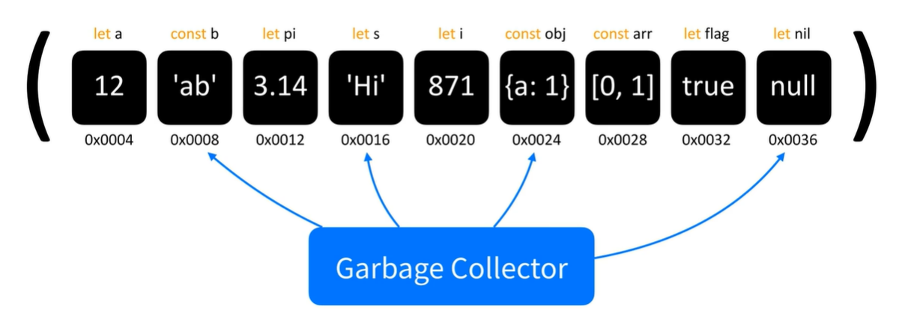
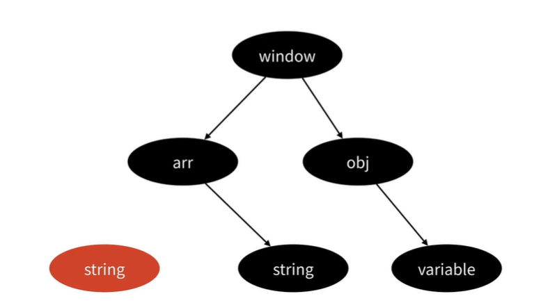

## 메모리 심화
  
위의 코드를 실행하면 JS 내부적으로 어떻게 처리하게 될까??  
JS에는 위 코드를 실행할때 변수에 코유 식별자를 생성하고 메모리에 주소를 할당한다.  
최종적으로 생성한 주소에 값을 넣게 된다.  

  
우리가 선언한 변수나 상수는 직접적으로 값을 바라보는 것이 아니라  
`메모리 주소`를 가리키고 있다.  

  
만약 새로운 변수에 기존변수를 대입하게 되면 어떻게 될까??  
`기존 변수의 메모리주소를 참조하게 된다.`  

  
만약 위에 그림처럼 기존 변수를 조작하게 되면 어떻게 될까???  
과연 두번째 생성한 변수도 값이 변하게 될까??  
이번에는 (Primitive 타입) 그렇지 않습니다.  
새로운 메모리 주소를 할당받고 그곳에 값을 넣게된다.  
그이유는 Javascript 에서는 원시타입(Primitive)타입은 변경이 불가능하게 때문이다.  
따라서 원시타입의 값이 변경될 경우는 항상 새로운 메모리를 할당합니다.  
  
## Heap 과 call Stack
자바스크립트의 엔진은 가상 머신으로 구성되어 있는데 이 가상머신안에는 메모리 모델을 구현해 두었는데  
각각 `Heap`, `call stack`영역으로 구성되어 있다.
  
이때 `Heap`은 참조타입이 `call stack`  원시타입이 할당된다.  
아까전에 변수할당을 `call stack`나타내 보자  

  

  
  
먼저 배열을 선언하게되면 `Heap에`배열 영역이 생성되고 `call stack`에 생성된 배열 변수는 `Heap`영역에 생성된 배열 영역의 메모리 주소를 참조하게 된다.  

  

이떄 `Heap`에 생성된 배열영역은 동적으로 크기가 결정된다.  
따라서 배열에 값을 추가하면 `Heap`메모리 영역에 그대로 할당이 된다.  
배열을 상수로 선언했는데 동작하는 이유이기도 합니다.  
배열을 `const`상수로 선언해도 `push`가 동작하는 이유는 `call stack`에 할당된 메모리를 변경하는 것이 아닌  
`Heap`메모리를 변경하는 것이기 때문이다.  
  
## Garbage Collector
만약 모든 로직을 끝마쳤을때 사용을 끝낸 메모리들은 어떻게 정리가 될까?  
garbage collector는 사용하지 않는 메모리를 해지아는 역할을 한다.
  
  
이때 현대적인 브라우저들은 `Mark and Sweep Algorithm`을 사용해서 메모리를 정리한다.  
  
## Mark and Sweep Algorithm
닿을 수 없는 주소를 더 이상 필요없는 주소로 정의하고 지우는 알고리즘  
브라우저의 최상위 객체인 window에서 시작하여 닿을 수 없는 곳은 필요없는 주소라 생각하여 지우는 알고리즘 이다.  

  

