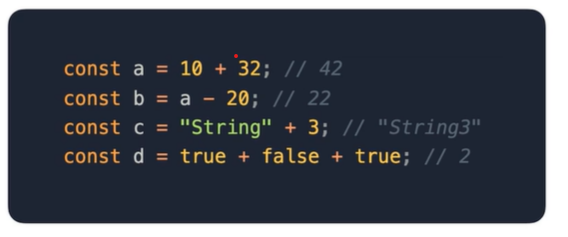
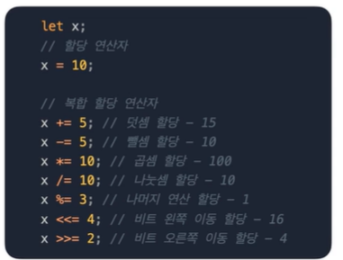
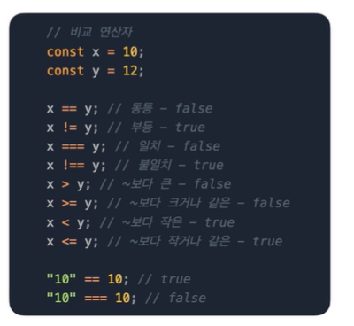
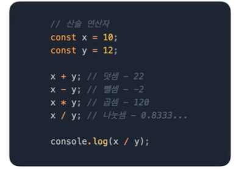
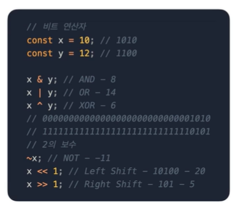
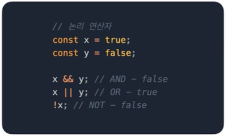
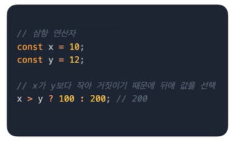
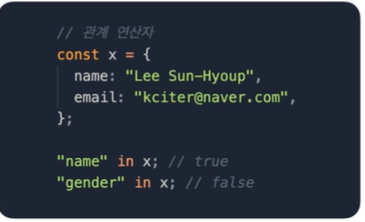
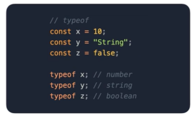

## 표현식 Expression
표현식이란 어떠한 결과 값으로 평가되는 식이다.  
숫자, 문자열, 논리값 같은 원시 값을 포함하여 변수, 상수, 함수 호출 등으로 조합할 수 있다.  

  
  
이런 표현식은 연산자를 조합하여 새로운 표현식을 만들 수 있습니다.
#### 할당 연산자  
할당 연산자는 오른쪽 표현식을 왼쪽 피연산자 값에 할당하는 연산자  
등호(=)를 사용하며 다른 연산자와 같이 사용하여 복합 할당 연산자로 이용할 수 있다.  

  
  
#### 비교연산자  
좌측 피연산자와 우측 피연산자를 비교하는 연산자  
true  혹은 false 를 반환한다.  

  
  
#### 산술연산자  
덧셈, 뺄셈, 곱셈, 나눗셈을 하는 연산자  
Number를 반환한다.  

  
  
#### 비트연산자  
비트를 직접 조작하는 연산자  

  
  
#### 논리연산자
Boolean을 통해 참과 거짓을 검증하는 연산자.  

  
#### 삼항 연산자  
조건에 따라 값을 선택하는 연산자  
`조건 ? 참 : 거짓 `형태를 가진다.  

  
  
#### 관계 연산자  
객체에 속성이 있는지 확인하기 위한 연산자  

  
  
#### typeof  
피연산자의 타입을 반환하는 연산자  
문자열로 반환된다.  

