## Control Flow  
Control Flow 는 흐름을 제어하는 방법중 하나이다.  
조건이나 반복을 통해 상태를 제어하는 것을 의미한다.  
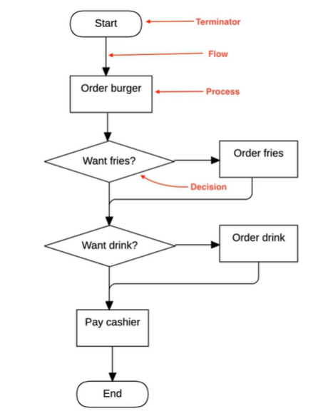  
  
일반적으로  
1. if/Then/Else
2. Switch/ Case
3. For/While  

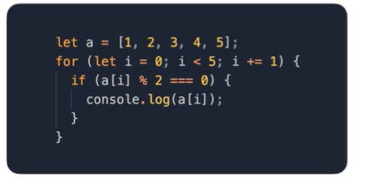  
  
#### Data Flow(함수형 프로그래밍 방식으로 구현이 가능)
1. Stateless
2. Recursion
3. Pipe  

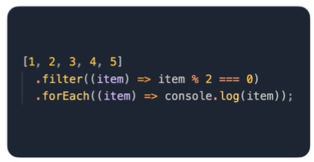  
  
## 조건문 
조건이 맞을 때만 실행되는 문장(Statements) 문법이다.  

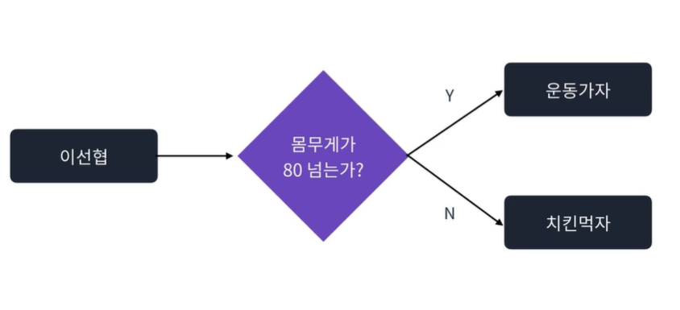  
  
#### if
괄호 안 조건식이 참인 경우 실행되는 문법  
else if, else 도 같이 사용할 수 있다.

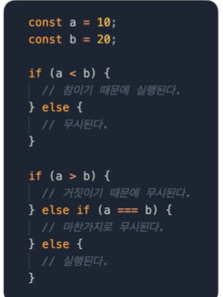  
  
이떄 false 뿐만 아닌 다음 값들도 거짓이 될 수 있으니 주의해야한다.  
false, undefined, null, 0, NaN, ''(empty string)  

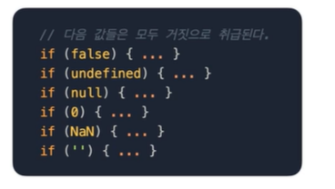  
  
#### switch  
괄호 안 값에 따라 분기되는 문법  
case, default와 함께 쓰인다.  
이떄 마지막에 `break`를 사용하지 않으면 다음 케이스도 실행이 된다.

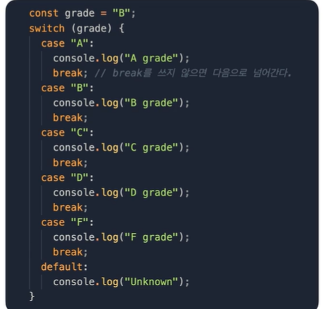  
  
## 반복문
반복적인 작업을 지시하는 문법이다.  

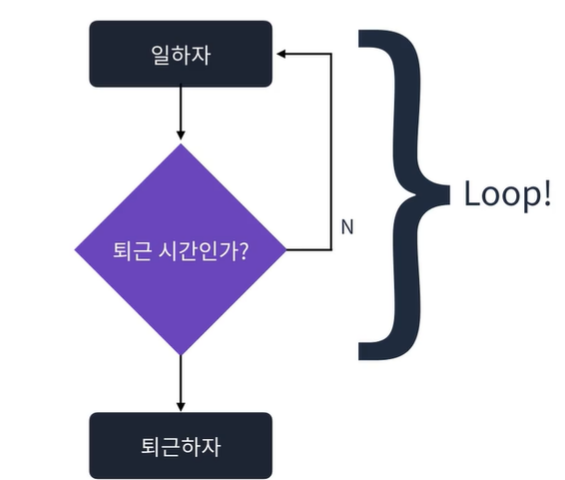  
  
#### for
가장 기초적인 반복문으로 초기문, 조건문, 증감문으로 이루어져있다.  
조건문의 결과가 거짓이 되면 반복이 종료된다.  

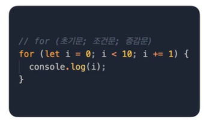  
  
#### while
괄호안 조건이 거짓이 될때까지 반복된다.  

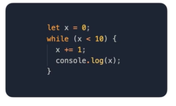  
  
#### do-while
while문과 다르게 먼저 진입 후 로직을 실행한 다음 조건을 검사한다.  

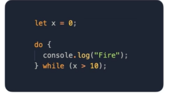  

