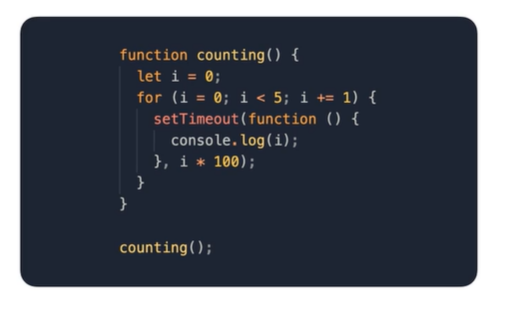

## 스코프
유효 볌위라고 부르며 변수가 어느 범위까지 참조되는 지를 뜻한다.  
어느 곳에서든 참조할 수 있는 전역(Global Scope) 스코프와  
해당 컨텍스트 내에서만 참조가능한 지역(Local Scope) 스코프가 있다.  
  

  
  
여기서 `var`를 사용하면 안되는 이유가 나온다.  
`var`를 사용하면 예상치 못한 오류가 생길 수 있다.  
`var`를 사용하게되면 호이스팅 되어 변수 선언이 상단으로 올라가버린다.  
따라서 블럭 레벨에 선언해도 블럭 외부 변수 값도 같이 변경되 버린다.  

  
  
## 클로저  
함수가 선언된 환경의 스코프를 기억하여 함수가 스코프 밖에서 실행될 때에도  
기억한 스코프에 접근할 수 있게 만드는 문법  

  

  

  
그런데 막상 `world()` 함수와 `sunhyoup()`함수를 실행 할때 greeting 변수에 접근하여 값이 출력하는 것을 볼 수 있다.  
이는 반환된 함수가 `const greeting` 변수를 계속 참조하고 있어 메모리에서 제거되지 않았기 때문이다.  
  
#### 은닉화
클로저를 이용하여 내부 변수와 함수를 숨길 수 있다.  

  
위처럼 내부의 counter 변수와 change 함수는 외부에서 접근이 불가능하다.  
따라서 반환된 객체를 통해서만  값을 조작할 수 있다.  
이런식으로 내부 변수와 함수를 숨김으로써 개발자의 실수를 줄여 나갈 수 있다.  
  
클로저를 잘 알아야하는 이유는 유용하게 사용하기보단 알기 힘든 `버그를 잘 수정하기 위해서`다.  

  
#### 출력 결과는??? 5555  
setTimeout의 콜백함수가 호출되는 시점에는 반복문이 종료되고 i 값이 증가하여 5가 되었기 때문이다.  
  
#### 해결방법
1. IIEE(즉시 실행함수)를 이용할 수 있다.  
  
즉시 실행함수를 이용하여 루프마다 클로저를 만들어 해결한다.  
  

  
  
2. let을 이용한다.  
  
let은 블록 수준 스코프기 때문에 매 루프마다 클로저가 생성된다.  

  

