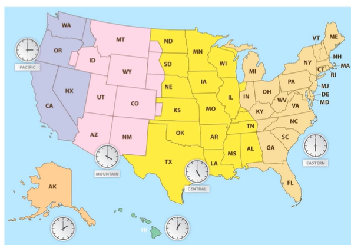

## 컴퓨터 시간
#### 컴퓨터 시간은 어떤 원리로 동작할까요??  
  
  
결국 컴퓨터에서 표현하는 시간은 현실에 존재하는 시간을 전산화 한것이기 때문에 `시간`이라는 개념을 잘 알아야한다.  
  
## 그전에 시간이 뭘까요? 어떻게 결정될까요?  
* 물리량  
    * 시간은 물리학 관점에서 봤을 때 시각과 시각 사이 간격을 표현하는 단위를 뜻한다.  
    * ex) 지금 이 순간(Instant)은 빅뱅(Epoch) 이후 시간이 얼마나 흘렀는가?  
* 위치  
    * 시간은 위치에 따라 다르게 표현될 수 있다.
    * ex) 경도 0도(UTC)가 정오일 때 동경 135도의 시각은?(경도상 위치)
    * ex) 런던이 정오일 때 미국의 시각은? (국가,지역)
* 천문 현상  
    * 지구자전속도의 불규칙성, 지구의 자전주기와 공전주기 등 처문 현상으로 인한 시간 보정이 필요하다.
    * ex) 윤초, 윤달, 윤년  
  
  
이다음은 `물리법칙`이 아닌 `협의`에 따른 표현이다.  

* 문화  
    * 문화에 따라 시간 표현이 다를 수 있다.
    * ex) 태양력, 태음력, 이슬람력, 에티오피아력 등
* 역사  
    * 역사적 사건에 의해 시간은 다르게 표현될 수 있다.
    * ex) 1582년 10월 4일 다음 날은? 만약 그레고리력을 사용한다면 1582년 10월 5일 부터 14일이 없기때문에 10월 4일 다음날은 10월 15일이 된다.
* 사회  
    * 사회적 제도에 의해 시간은 변할 수 있다.
    * ex) 일광 시간 절약제(Summer Time)  
  
## 꽤 많은 조건을 고려하여 시간을 표시해야함  
#### 역사적 사건, 사회적 제도같이 규칙이 존재하지 않는 경우엔 어떻게 처리하지??  
  
## 협정 세계시(UTC)
* 원자 시계와 윤초 보정을 기반으로 표준화한 시각
* 모든 시간대는 UTC+0을 기준으로 환산한다.
* 대한민국의 시간은 UTC+9  
    * 예를 들어, 영국(UTC+0)이 오전 1시라면 대한민국은 오전 10시가 된다.  
* 표기법은 ISO 8601을 따른다.
    * 2021-03-20T09:00:00.000Z // UTC+0 기준 2021년 3월 20일 9시
    * 2021-03-20T09:00:00.000Z+09:00 // UTC+9 (한국 시간)기준 2021년 3월 20일 9시
    * 가운데 `T`는 `Time`을 의미하고 시간 뒤 `Z`는 `Zulu Time`을 뜻한다.  
        * 경도 0(Zero)의 앞글자 `z`를 나타내고 `z`는 무선 통신 용어로 `Zulu`라고 표현된다.  

  
  
참고로 경도상 시간과 국가 시간은 다를 수 있다.  
  
## 컴퓨터가 시간을 표현하는 방법
* 하드웨어의 시스템 클럭을 이용한다.
* 특정 시각(Epoch)을 기준으로 시스템 클럭의 틱을 세는 것으로 구현된다.
* 이를 **시스템 시간**이라 부른다.
* 시스템 시간을 값으로 표현한 것을 **타임스탬프(Timestamp)**라고 부른다.
* 타임스탬프는 운영체제마다 기준 시간과 단위가 다를 수 있다.
* 유닉스 계열 운영체제에서 시간을 표시하는 방법을 **Unix Time**이라 부른다.  
  
## 시스템 클럭의 원리
* RTC(Real Time Clock)라는 모듈을 사용한다.
* RTC는 메인보드에 붙어있어 전원을 끄더라도 계속 작동한다.
* RTC는 카운터 회로를 통해 클럭을 발생시킨다.  
  * 카운터 회로의 핵심 부품인 결정 진동자가 만드는 정확한 주파수를 이용한다.
  * 보통 1클럭에 32.768Hz가 발생한다.
  * 32.768Hz인 이유는 1초를 계산하기 편해서이다.
    * https://noel-embedded.tistory.com/43

  
  
## Unix Time
* 1970년 1월 1일 0시 0분 0초가 기준 시각이다.
* 1970년 1월 1일인 이유는 유닉스를 개발한 데니스 리치가 그냥 이유 없이 정한 날짜다.
* 1970년 이전 시간은 음수로 표현된다.
* 초 단위로 시간이 증가한다.

  
  

## 현재 시간을 어떻게 알아낼까???
* 컴퓨터를 키면 자동으로 현재 시간을 보여준다. 어떻게 알아낼까?
* 시스템 시간을 네트워크 타임 프로토콜(NTP)를 통해 동기화 할 수 있다.
* NTP 서버에 네트워크 요청을 하여 현재 시간을 받을 수 있다.
* NTP 서버는 계층으로 이루어져 있으며 그 계층을 Stratum이라고 부른다.
* 최상위 계층을 PRC(Primary Reference Clock)이라고 부른다.  

  
  
## 시간대를 어떻게 고려해야 할까?
* 국가, 지역별 시간이 다를 수 있다.
* 프랑스, 러시아, 미국처럼 시간대가 여러 개거나 시간대가 바뀐다면?
* 일광 시간 절약제가 시행된다면?
* Time Zone 데이터를 이용할 수 있다.
* 현실 세계에 이벤트가 발생되면 업데이트 된다.
* 표기법은 다음과 같다.  
  * Asia/Seoul
  * America/New_York
  * 대륙/도시 형태를 가진다.
  * 이 값을 `Zoneld`라고 부른다.  

  
  
## 시간을 어떤 기준으로 사용해야 할까?
* 글로벌 서비스를 운영한다면 시간이 매우 중요해진다.
* 그냥 전부 Time Zone 적용하면 되는 것 아니야? -> 아니다!
* 서비스에서 사용되는 시간을 용도에 맞춰서 기록할 필요가 있다.  
  
## 순수한 시간
* 박정환의 생일은?
  * 10월10일
  * 내가 한국에서 10월 10일에 태어났지만 미국 시간으론 10월 09일이니 미국 생일은 10월 09일이야~  
  그러니까 미국 생일도 챙겨줘! 라고 하면 어떻게 생각할까? <- 이처럼 Time Zone을 잘못 사용하면 위와 같은 불상사가 발생할 수 있다.
* 시간대와 지역, 문화, 사회를 고려하지 않고 순수하게 시간을 기록해야하는 경우가 있다.  
  * 생일
  * 기업 설립일
  * 기념일
  * 국경일  
  
## UTC
* 역사, 사회. 문화에 대한 맥락 없이 **사건이 발생한 시각**만을 고려할 때 사용한다.  
  * 로깅
  * 감사
  * 시계열 데이터  

  

  
## Time Zone이 적용된 시간  
* 역사, 사회, 문화를 고려하여 사용자가 이용한 시각을 정확히 알아야할 때 사용한다.
* UI에 표시되는 시간을 사용자 기준으로 보여줄 때 사용한다.  
  * 결제 시각
  * 푸시 알림 시간
  * UI 시각 표시
  * 캘린더  
  
## Javascript 에서 사용법
* 간단하게 사용하면 Date 객체를 사용할 수 있다.
* 가장 유명한 moment.js 는 Deprecated 되어있다.  
  * 대체 라이브러리로 date-fns, luxon 을 사용할 수 있다.

