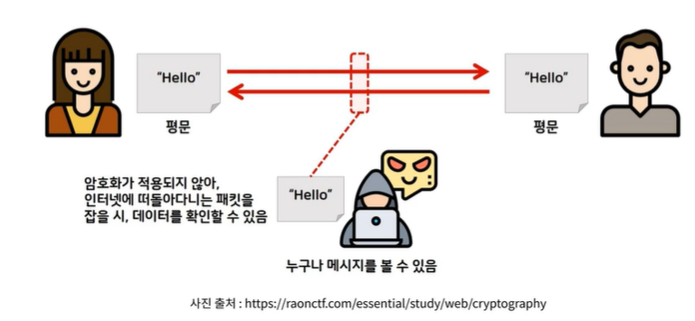
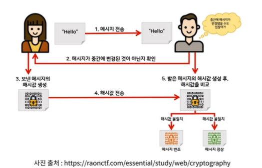
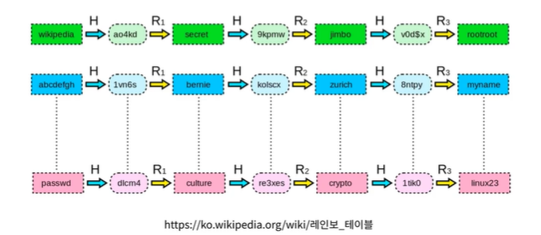
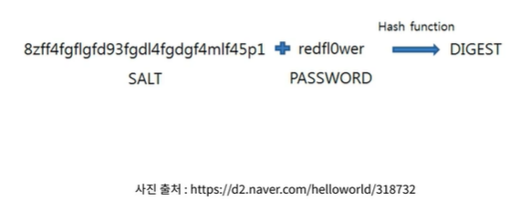
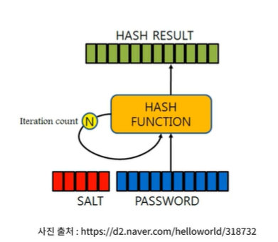
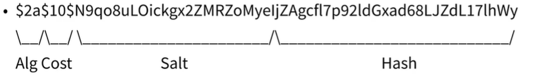
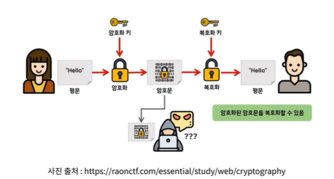
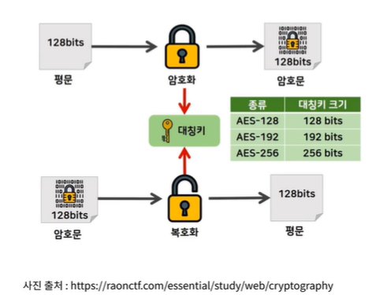
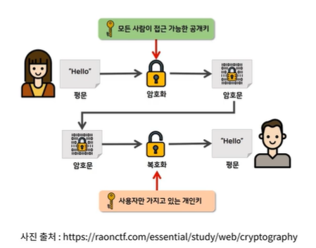

## 암호화
* 평문(Plaintext)을 해독할 수 없는 암호문(Ciphertext)로 변환하는 것을 의미한다.
* 단방향(해싱)과 양방향 암호화가 존재한다.  

  
  
## 단방향 암호화
* 해시 알고리즘을 이용하여 평문을 복호화 할 수 없는 형태로 암호화한다.
* 대표적으로 `MD5`와`SHA` 알고리즘이 있다
* 사용자 비밀번호 등을 저장할 때 자주 사용된다.
* MD5 와 SHA-0, SHA-1 은 해시 충돌이 발생할 수 있는 취약점이 있기에 사용을 권하지 않는다.  

  
  
## 단방향 암호화에서 고려할 점
* 복호화가 불가능하지만 `Rainbow Table`을 통해 원문을 알아낼 수도 있다.
    * `Rainbow Table`은 평문과 해시 함수로 만든 문자열을 모두 저장시켜 놓은 표를 말한다.
* 따라서 불의의 사고로 암호화된 데이터를 탈취당하더라고 원문을 알아 낼 수 없도록 조치를 해야한다.
* Salt, Key stretching를 이용하여 해결할 수 있다.  

  
  
## Salt
* 평문에 임의의 문자열을 추가하여 암호화하는 방법을 말한다.
* 재료에 소금을 곁들여 먹는것에 비유한 방법
* `Salt`는 128bit 이상으로 만들 것을 권장한다.
* 사용자마다 다른 Salt를 사용하게 하면 더 안전하다.  

  
  
## Key stretching
* 해시를 여러 번 반복하여 원문을 알기 힘들게 만드는 방법
* 일반적인 시스템에서 0.2초 이상 반복되면 안전하다고 한다.  

  
  
## Salt 와 Key stretching을 이용하는 알고리즘
* 직접 구현하는 것보다 이미 검증받은 알고리즘을 사용하는 것이 안전하다.
* PBKDF2
  * NIST(미국표준기술연구소)에서 승인된 알고리즘
  * DIGEST = PBKDF2(PRF,Password,Salt,c,DLen)
* bcrypt
  * 비밀번호 저장을 목적으로 탄생한다.
  * OpenBSD에서 기본으로 사용하고 있는 알고리즘.

  
  
## 양방향 암호화
* 평문을 복호화 할 수 있는 형태로 암호화하는 방법
* 대칭키와 비대칭키 알고리즘으로 나뉜다.
* 대표적으로 대칭키를 이용하는 AES와 비대칭키를 이용하는 RSA로 나뉜다.

  
  
## 대칭키 암호 알고리즘
* 대표적으로 `AES(Advanced Encryption Standard)`가 있다
* 같은 키를 이용하여 암호화, 복호화가 가능하다.  

  
  
## 비대칭키 암호 알고리즘
* 대표적으로 `RSA(Rivest, Shamir and Adleman)`가 있다.
* 이름이 특이한데 RSA 알고리즘을 만든 사람들 3명 이름을 따서 만들었기 때문이다.
* 공개키와 개인키 두 가지 키가 존재한다.
* RSA는 소인수 분해를 기반으로 만들어진 알고리즘이다.  

  
  
## Javascript 에서 이 모든 것을 이용하는 방법
* crypto-js를 사용할 수 있다.
  * https://github.com/brix/crypto-js
* crypto-js에 bcrypt는 구현되어있지 않아 다른 라이브러리를 알아봐야한다.
  * https://github.com/kelektiv/node.bcrypt.js  
  

  
