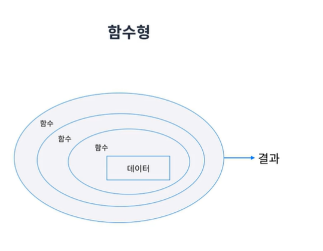

## 함수형 프로그래밍
#### 함수형 패러다임
패러다임은 무엇을 해야 할지를 말하기보다 무엇을 해서는 안 되는지 말해준다.  
  
## 프로그램은 순차, 분기, 반복, 참조로 구성된다.
패러다임을 위 4가지 요소를 어떻게 이용할 것인가를 다룬다.  
  
#### 객체지향  
객체라는 것을 통해서 데이터를 묶고 이 객체들끼리 통신, 의사소통하면서 프로그램이 동작한다.  

  
  
#### 함수형
데이터를 함수를 이용해서 새로운 데이터를 만들어 나가는 데이터 파이프라인 형태로 프로그램이 작동한다.  

  
  
## 함수형 패러다임
* 객체지향 추상화의 최소 단위가 객체인 것처럼 함수형은 함수가 최소 단위다.
* 함수 단위로(객체보다 더 작은 단위로) 나눠지므로 재사용성이 높다.
* 불변성 지향하기에 동작을 예측하기 쉽고 사이드 이팩트를 방지한다.
  * 사이드 이펙트를 방지한다는 것은 동시성 문제도 해결된다는 의미 
* 객체지향은 `제어 흐름의 간접적인 전환`에 부과되는 규율
  * 즉 순차, 분기, 반복, 참조의 4가지 제어 흐름의 전환을 객체를 통해 간접적으로 통제를한다.  
* 함수형은 `변수 할당`에 부과되는 규율
  * 함수형은 순차, 분기, 반복, 참조의 4가지 제어 흐름을 변수 할당을 통해 통제한다.  
  
#### Quiz
```
    N개의 숫자가 공백 없이 쓰여있다.
    이 숫자를 모두 합해서 출력하는 프로그램을 작성하시오.
    ex) "12345" -> 15
```  

  
  
#### 객체지향 관점
숫자 문자열 형태를 담고 있는 StringNumber 객체가 존재하고  
이객체는 계산하여 합을 보여주는 역할을 부여 받았습니다.  
그리고 계산한 값은 객체에 저장됩니다.  
값을 출력하는 것은 Printer 객체가 담당하게 되고  
단순히 StringNumber 객체는 계산된 값의 결과를 Printer 객체에 전달하기만 한다.  
  
#### 절차지향 관점
공유 데이터인 stringNumber 와 Sum 변수가 있다.  
이를 반복문을 통해 조작해 준다.  
  
#### 함수형 프로그래밍
함수형 프로그래밍은 데이터를 모두 함수실행의 연속으로 구현합니다.  
먼저 문자열을 자르는 함수 이어서 정수로 변환해주는 함수 , 각 요소를 합해주는 함수  
마지막으로 출력해주는 함수 , 이렇게 함수들을 조합하여 결과를 도출한다.  
  
## 함수형 프로그래밍의 장점
* 상태가 없기 때문에 사이드 이펙트가 없다.
* 재사용성이 높다.
* 코드가 짧고 간결하다.  
  
## 함수형 프로그래밍의 단점
* 상태가 없기 때문에(변수가 없다) 사이드 이펙트가 없다.(즉 상태를 조작할 수 없기 때문에 다른방법을 찾아야한다.)
  * 예를 들어 게임에서 몬스터에게 맞으면 hp가 떨어진다 이때 겍체지향 프로그래밍에서는 해당 겍체의 hp값을 감소시켠 되지만  
    함수형 프로그래밍 에서는 상태가 없기 때문에 다른 방법을 찾아야한다.
  * 그 방법은 캐릭터와 관련된 데이터를 hp를 감소시킨 상태로 복사한후 기존 캐릭터와 교체하는 방법이다.
* 재사용성이 높다.
  * 너무 작은 단위로 함수를 쪼개다보면 해당 함수를 기억하지 못할 수도 있다.
* 코드가 짧고 간결하다.
  * 함수형 적으로 사고하고 코드가 간결해지기 위해서는 많은 숙련도를 요구한다.
  
## 선언형 프로그래밍
* 기존 명령형 프로그래밍은 **문제를 어떻게 해결해야 하는지** 컴퓨터에게 명령을 내리는 방법
* 선언형 프로그래밍은 **무엇을 해결해야 할지**에 집중하고 해결 방법은 컴퓨터에게 위임하는 방법  

  
  
  
## 멀티 패러다임
Javascript는 멀티 패러다임이 가능하다.  
굳이 객체지향과 함수형으로 나눌 필요 없이 둘 다 쓰자!  

  
