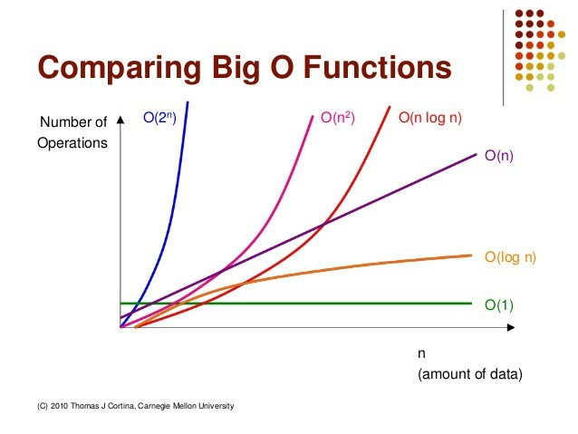

#### 빅오 표기법(Big-O notation)  
  

빠른 순서  
O(1) < O(log n) < O(n) < O(n log n) < O(n²) < O(2ⁿ) < O(n!)  
상수시간 < 로그시간 < 선형시간 < 선형로그시간 < 2차시간 < 지수 시간 < 팩토리얼 시간  
로그 시간은 위치에 * 2이다 위치가 생략되면 기본적으로 2라고 생각  

O(n) 선형시간  : 이력받은 크기만큼 반복
```
     for(let i = 0; i<n; i ++){
     }
```  

O(log n) 로그시간 : 입력받은 크기에 로그를 씌운 크기만큼 반복
```
     for(let i = 0; i<n; i*=2){
     }
```    

O(n log n) 선형 로그시간 : 선형시간에 지수시간을 곱한만큼 반복
```
     for(let i = 0; i<n; i++){
       for(let j = 0; j=<n; j*=2){
        }
     }
```    

O(n²) 2차시간 : n에 제곱만큼 반복한다.
```
     for(let i = 0; i<n; i*=2){
        for(let j =0; j<n; j++){
        }
     }
```      

#### 계수 법칙
상수 K가 0보다 클때 f(n) = O(g(n)) 이면 kf(n) = O(g(n)) 이다.  
**n이 무한에 가까울 수록 k의 크기는 의미가 없기 때문이다.** 그래서 빅오표기법에서는 샐략한다.  
```
        for(let i = 0; i<n; i ++){
     
     }
        for(let i = 0; i<n*5; i ++){
        
     }
    두루프는 같은 O(n)으로 표기한다.
```
#### 합의 법칙 : 빅오 끼리는 더해질 수 있다.
```
        for(let i = 0; i<n; i ++){
     
     }
        for(let i = 0; i<m*5; i ++){
        
     }
    두루프를 합쳐 O(n + m)으로 표기할 수 있다.
```
#### 곱의 법칙 : 빅오 끼리는 더해질 수 있다.  
```
     for(let i = 0; i<n; i*=2){
        for(let j =0; j<n*5; j++){
        }
     }
     두 루프를 곱해 O(n^2)으로 표기할 수 있다.
```      
#### 다항 법칙 
```
        for(let i = 0; i<n * n * n; i ++){
     
     }

    다음 루프는 O(n^3)으로 표기할 수있다.
```  

#### 두가지의 핵심  
1. 상수항은 무시  
```
        for(let i = 0; i<n; i ++){
     
     }
        for(let i = 0; i<m*5; i ++){
        
     }
    두루프를 합쳐 O(n + m)으로 표기할 수 있다.
```
2. 가장 큰 항 외엔 무시  
```
    for(let i = 0; i<n; i ++){
     
     }

     for(let i = 0; i<n; i*=2){
        for(let j =0; j<n*5; j++){
        }
     }
     O(n^2+n) 이지만 작은 항은 무시하여
     O(n^2)으로만 표기해도 된다.
```     

  

## JS에서 성능을 측정하는 방법  
1. Date 객체를 이용
```
    const start = new Date().getTime();
    // ....

    const end = new Date().getTime();
    console.log(end-start);
```
