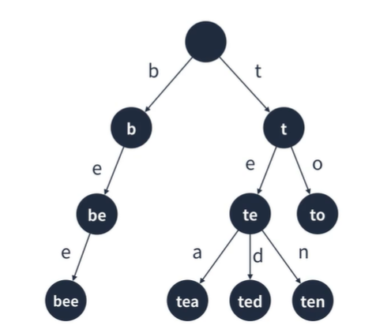
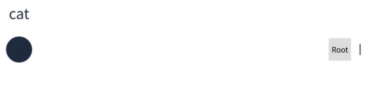
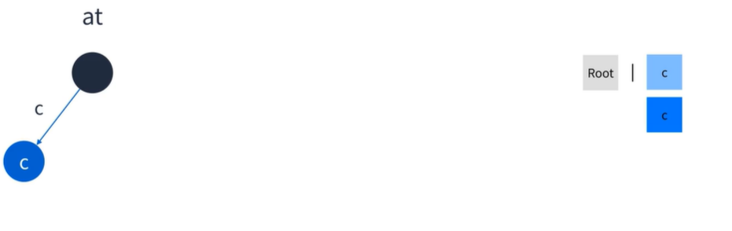
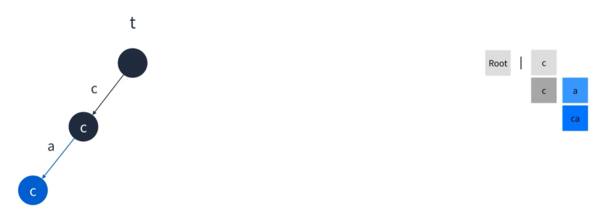
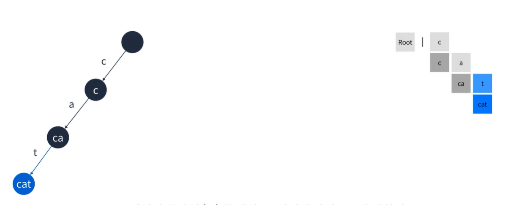
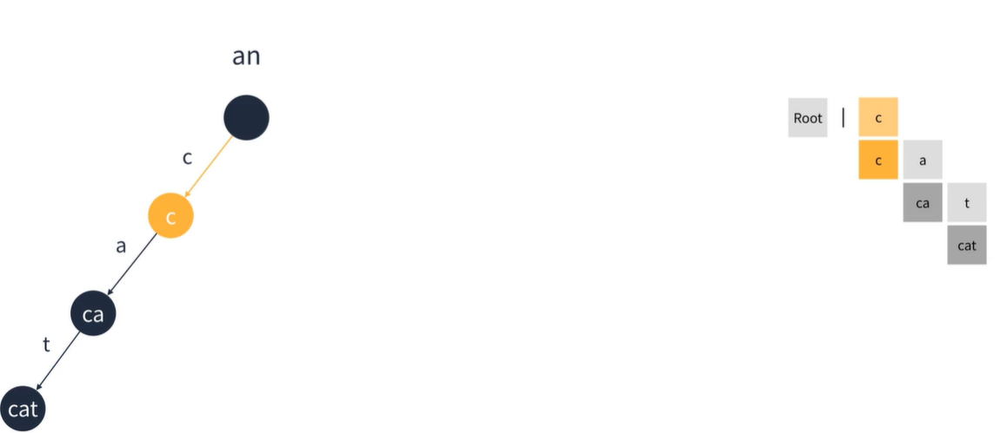
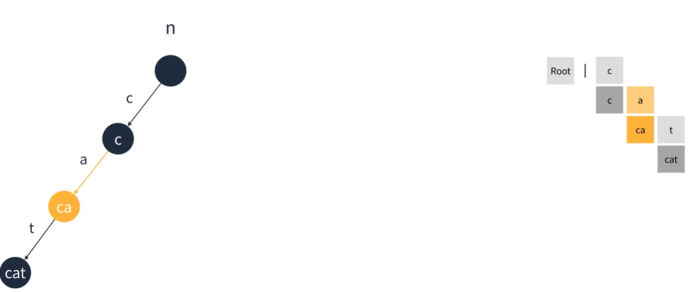

## 트라이  
문자열을 저장하고 효울적으로 탐색하기 위한 트리 형태의 자료구조(검색 엔진의 자동완성)  
간선은 이전 정점으로부터 새롭게 추가되는 문자정보를 가지고 있다.  
정점은 이전 정점으로부터 더해진 문자열 정보를 가지고 있다.
  
  
#### 트라이의 특징
1. 검색어 자동완성, 사전 찾기 등에 응용될 수 있다.
2. 문자열을 탐색할 때 단순하게 비교하는 것보다 효율적으로 찾을 수 있다.
3. L이 문자열의 길이일 때 탐색, 삽입은 O(L)만큼 걸린다.
4. 대신 각 정점이 자식에 대한 링크를 전부 가지고 있기에 저장 공간을 더 많이 사용한다.  

  
  
#### 트라이 구조
1. 루트는 비어있다.
2. 각 간선(링크)은 추가될 문자를 키로 가진다.
3. 각 정점은 이전 정점의 값 + 간선의 키를 값으로 가진다.
4. 해시 테이블과 연결 리스트를 이용하여 구현할 수 있다.  
  
Step 1 : 처음엔 빈 루트 정점만 존재한다. 여기에 cat이라는 문자를 추가해보자  
  

Step 2 : 맨 앞 문자열을 'c'를 잘라 루트 정점의 자식으로 추가한다.  
  
  
Step 3 : 맨앞 문자열 'a'를 잘라 c 정점의 자식으로 추가한다. 이때 간선의 키는 'a'가된다.  
  
  
Step 4 : 마지막 문자열 't'를 잘라 ca 정점의 자식으로 추가한다.  
  
  
Step 5 : 이번엔 문자열 can을 추가한다. 맨 앞 문자열 'c'를 자른 후 확인한다. 이미 정점이 있기에 이동만 한다.  
  
  
Step 6 : 맨 앞 문자열 'a'를 자른후 확인한다. 이미 정점이 있기에 이동만 한다.  
  
  
Step 7 : 맨앞 문자열 'n'를 자른 후 확인한다. 'n'간선은 없기에 정점을 추가한다.  
  
