##이진 탐색  
  
정리 안된 책장에서 원하는 책을 찾는 방법은 보통 특정방향으로 순차적으로 찾을 것이다.  
이런 방법은 탐색을 **선형 탐색**이라고 한다.  
  
#### 선형탐색
순서대로 하나씩 찾는 탐색 알고리즘  
O(n) 시간복잡도가 걸린다.  
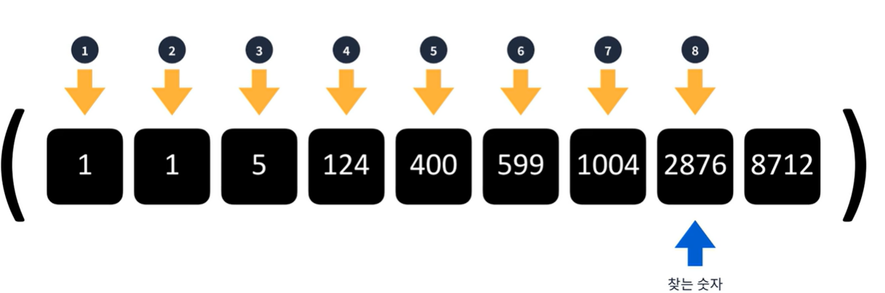  
  
#### 이진탐색
우리가 업 다운 게임처럼 어떤 값이 크고 작음에 따라 그 범위를 좁혀 나가는 방식과 유사하다.  
정렬 되어있는 요소들을 반씩 제외하며 찾는 알고리즘  
O(log n)만큼 시간 복잡도가 걸린다.  
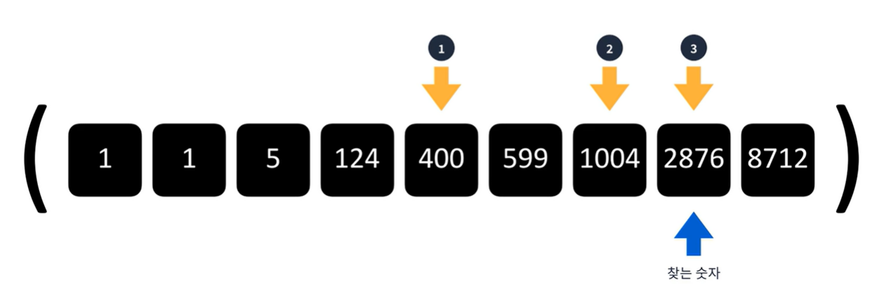  
  
#### 이진 탐색의 특징
1. 반드시 정렬이 되어있어야 사용할 수 있다.
2. 배열 혹은 이진 트리를 이용하여 구현할 수 있다.
3. O(log n ) 시간복잡도인 만큼 상당히 빠르다.  
  
 #### 배열 구현  
45를 찾아라  
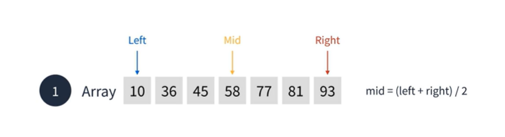  
이진탐색은 맨 처음을 Left, 맨 끝 지점을 Right 라고 한다.  
이때 그 중간지점을 Mid 라고 표현한다.  

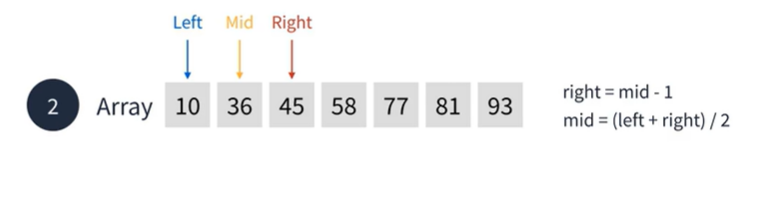  
이때 찾을 값인 45와 Mid를 비교한다. 58보다 45가 작기때문에 Right에 값을 Mid 한칸뒤에 위치시키고  
다시 Mid 값을 구한다.

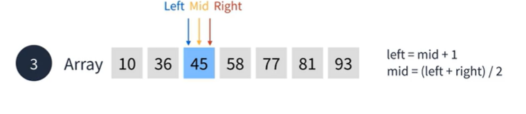  
이번에는 36이 45보다 작기때문에 Left가 36의 오른쪽으로 이동한다.  
이때 Left 와 Right의 값이 45로 동일하기 때문에 Mid의 값도 45가 된다.  
마지막으로 찾을 45의 값과 Mid의 값이 동일함으로 탐색이 종료된다.  
배열로 구현하는 방식은 중간에 추가하고 삭제하는데 있어서 선형시간이 걸린다는 단점이 존재한다.  
  
  
#### 이진탐색 트리를 이용한 구현
이진 탐색을 위한 이진 트리로 왼쪽서브 트리는 루트보다 작은 값이 모여있고  
오른쪽 서브트리는 루트보다 큰 값이 모여있다.  
  
  
#### 이진 탐색 트리 요소 추가  
Step 1: 5를 추가, 그러면 Root가 5가된다.  
  
  
Step 2: 4를 추가한다. 4는 5보다 작기때문에 왼쪽 정점에 위치한다.  
  
  
Step 3: 7을 추가한다 7은 root 5보다 크기때문에 오른쪽 정점에 위치한다.  
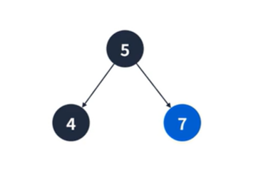  
  
Step 5: 8은 루트 5보다 크기때문에 오른쪽 정점에 위치하고 서브트리의 Root인 7보다 크기때문에 7의 오른쪽 정점에 위치한다.  
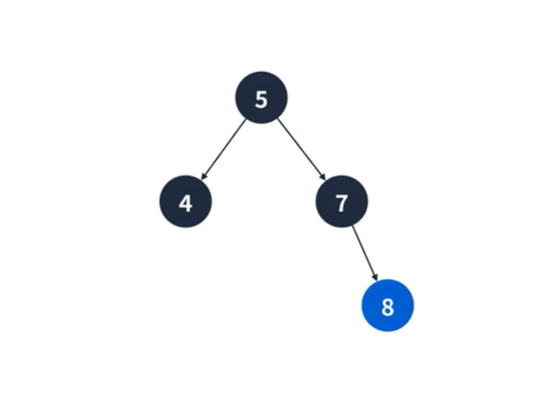  
  
Step 6: root의 값과 같은 5를 추가한다. 동일한값을 추가하는 경우 왼쪽 정점인든 오른쪽 정점이든 상관없다.  
여기서는 왼쪽 정점에 추가해 본다. 서브트리의 root인 4보다 크기땜누에 오른쪽 정점에 위치한다.  
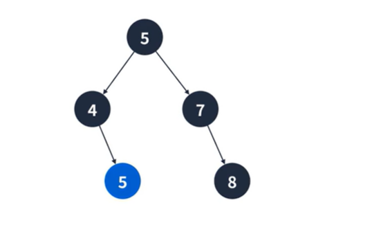  
  
Step 7: 6을 추가한다.  
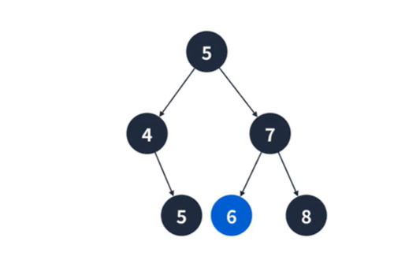  
  
Step 8: 2를 추가한다.  
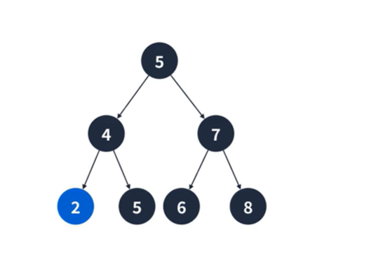  
  
  
#### 이진 탐색트리 삭제
1.단말 정점을 삭제하는 경우  
별다른 처리 없이 부모 정점과의 연결을 끊으면 된다.  
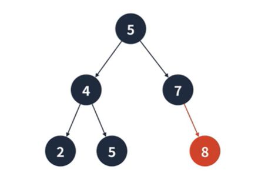  
  
2.하나의 서브 트리를 가지는 경우  
제거되는 정점의 부모 간선을 자식 정점을 가르키게 바꾸면 된다.  
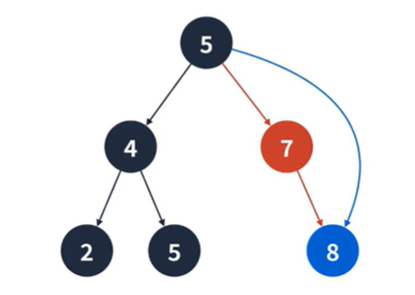  
위의 그림에서 7을 제거하면 5의 오른쪽 간선을 8을 가르키게 바꾼다.  
  
3.두개의 서브 트리를 가지는 경우  
왼쪽 서브 트리의 가장 큰 값 혹은 오른쪽 서브 트리의 가장 작은 값과 교체하면 된다.  
이 경우 교체된 정점의 좌우 자식이 없다면 제거되는 정점의 링크로 대체된다.  
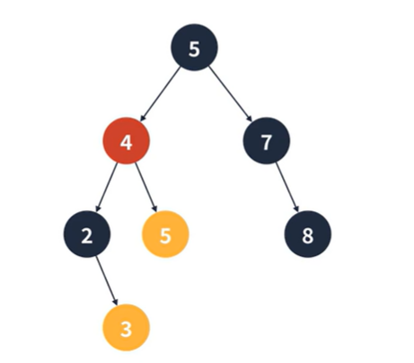  
위의 경우 4를 제거하면 3과 5 정점중 하나와 교체하면 된다.  
  
  
#### 이진 탐색 트리의 문제점  
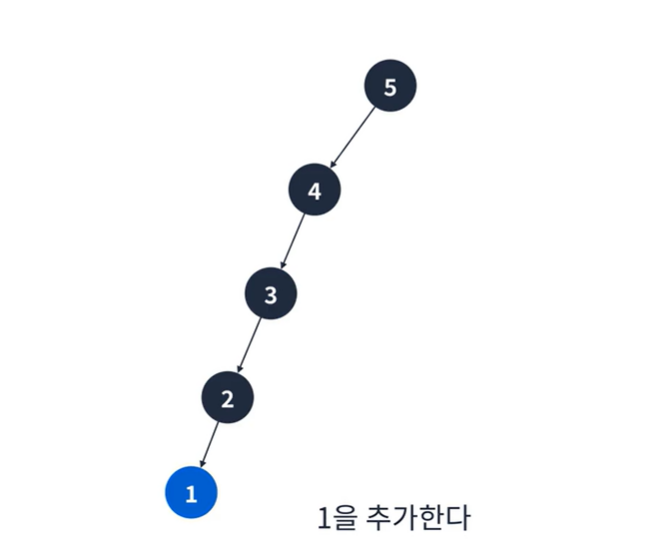  
1. 최악의 경우 한쪽으로 편향된 트리가 될 수 있다.
2. 그런 경우 순차 탐색과 동일한 시간복잡도를 가진다.
3. 이를 해경하기 위해 다음과 같은 자료구조를 이용할 수 있다. AVL 트리 , 레드-블랙 트리

