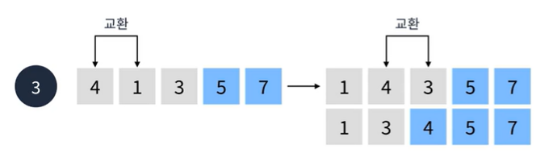
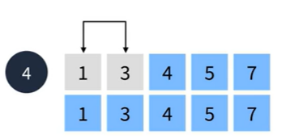
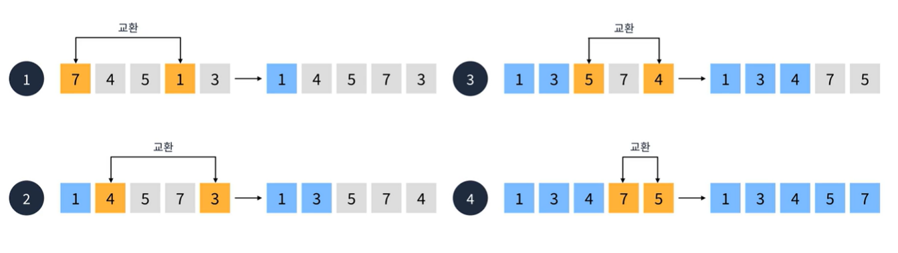
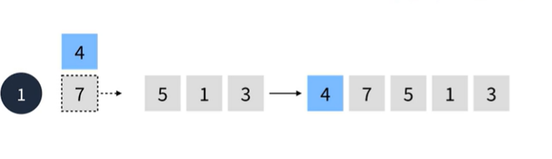
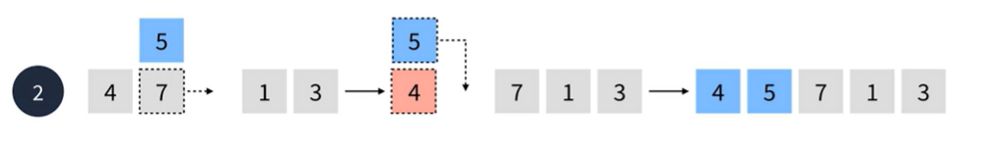
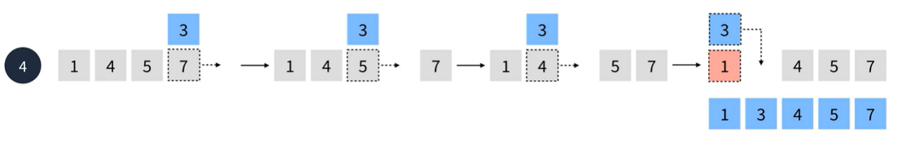
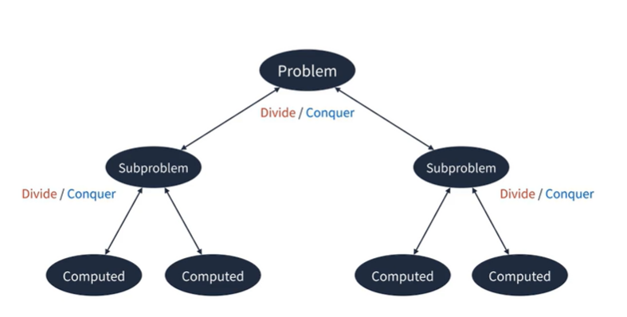
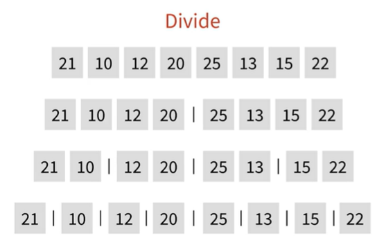
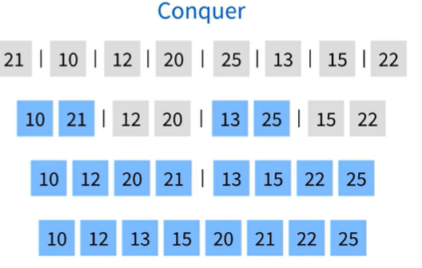
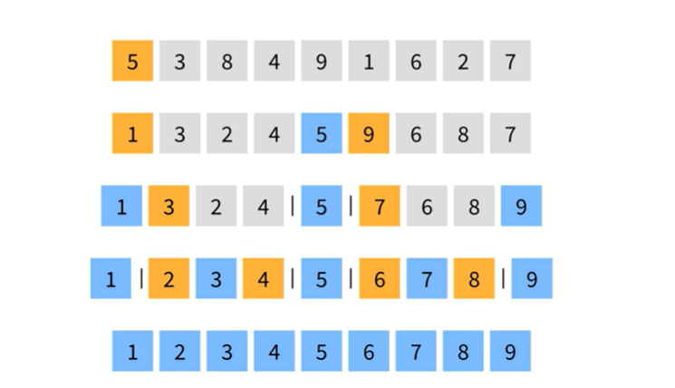

## 정렬
요소들을 일정한 순서대로 열거하는 알고리즘  
  
#### 정렬의 특징
1. 정렬 기준은 사용자가 정할 수 있다.
2. 크게 비교식과 분산식 정렬로 나눌 수 있다.
3. 대부분의 언어가 빌트인으로 제공해준다.
4. 삽입, 선택, 버블, 머지, 힙, 퀵 정렬 등 다양한 정렬 방식이 존재한다.  
  
  
#### 어떤 정렬이 제일 빠를까?
[Sorting Algorithms](https://www.toptal.com/developers/sorting-algorithms)  
링크에 들어가서 어느 정렬이 빠른지 확인해 보자.  
  
## 비교식 정렬  
  
#### 버블 정렬
서로 인접한 두 요소를 검사하여 정렬하는 알고리즘  
O(n²)시간복잡도를 가진다.  
  
첫번째 요소에서 인접한 요소를 검색한다.  
7보다 4가 더 작기 때문에 오름차순에 따라 두 값을 교환한다. 이런식으로 마지막요소 까지 비교하면  
마지막 요소가 정렬이 완료되고 1번의 순회가 완료된다.  
  
  
  

#### 선택 정렬
선택한 요소와 가장 우선순위가 높은 요소를 교환하는 정렬 알고리즘  
O(n²)시간복잡도를 가진다.  
  
1. 먼저 선택된 첫번째 요소와 나머지 요소중 가중 우선순위가 높은 요소 1 과 교환한다.
2. 그다음 2번째 요소와 나머지 요소중 가장 우선순위가 높은 3과 교환한다.
3. 3번째 요소와 나머지중 가장 우선순위가 높은 요소와 교환
4. 마지막으로 남은 두요소를 비교한후 교환한다.
  
  
#### 삽입 정렬
선택한 요소를 삽입 할 수 있는 위치를 찾아 삽입하는 방식의 정렬 알고리즘  
O(n²)시간복잡도를 가진다.  
  
삽입 정렬은 두번째 요소부터 시작한다.  
4를 선택하여 7과 비교한 후 7이 더크기때문에 7을 밀어내고 4를 삽입한다.  
  
7은 4보다 크기 때문에 넘어가고 두번째 순회를 시작한다.  
3번째 요소인 5를 선택한후 5와 7을 비교한후 7이 더크기 때문에 7을 밀어낸다.  
다음 5와 4를 비교해서 5가 4보다 크기때문에 밀어내지못하고 그자리에 삽입된다.  

  
1을 선택한후 이전 요소들과 비교하면서 더큰 값들을 밀어낸다.  
  
삽입정렬은 복잡하지만 어느정도 정렬만 되어있다면 퀵정렬보다도 빠르게 처리된다.  
  
## 분산식 정렬
  말그대로 요소를 분산하여 정렬하는 방식을 뜻한다.
#### 분할 정복
문제를 작은 2개의 문제로 분리하고 더 이상 분리가 불가능 할 때 처리한 후 합치는 전략  
다양한 알고리즘에 응용된다.  
  
  
#### 합병 정렬
분할 정복 알고리즘을 이용한 최선과 최악이 같은 안정적인 정렬 알고리즘  
O(n log n) 시간 복잡도를 가진다.  
  
합병 정렬은 우선 요소를 나누는 작업부터 시작한다.  
먼저 요소를 절반으로 나눈다음 각 요소가 하나 가 될때까지 절반으로 나눈다.  
  
모든 요소를 나누었다면 합치는 알고리즘을 수행한다.  
나눈 것을 합치면 먼저 두요소중 작은것을 먼저 배치한다.  
  
#### 퀵 정렬
분할 정복 알고리즘을 이용한 매우 빠르지만 최악의 경우가 존재하는 불안정 정렬  
O(n log n) 시간 복잡도를 가진다.  
  
퀵 정렬은 피벗이라는 기준으로 좌측 과 우측을 나눈다.  
여기서는 첫번째 요소인 5를 피벗이라 정하고 5를 기준으로 작은 값은 왼쪽에 큰값을 오른쪽에 배치한다.  
그리고 다시 나뉜 배열에서 첫번째 요소가 피벗이 된다.  
각각 1 과 9를 기준으로 나눈다.  
이런식으로 각 피벗을기준으로 나누고 더이상 나눌 수 없는 상태가 되었다면 그대로 합쳐준다.  \
그러면 요소들이 정렬된 상태로 나열된다.

