## Breadth-Fist Search(너비 우선 탐색)
그래프 탐색 알고리즘으로 같은 깊이에 해당하는 정점부터 탐색하는 알고리즘
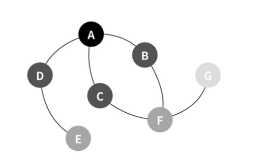
  
#### BFS의 특징
1. Queue를 이용하여 구현할 수 있다.
2. 시작 지점에서 가까운 정점부터 탐색한다.
3. V가 정점의 수, E가 간선의 수일 때 BFS의 시간복잡도는 O(V+E)다.
  
Step 1 : Queue A  
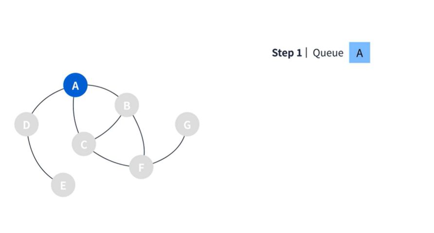  

Step 2 : Queue B C D  
기존에 있던 A를 디큐하고 A로부터 이동할 수 있는 간선의 수를 확인하여 해당 정점들을 모두 큐에 넣는다.  
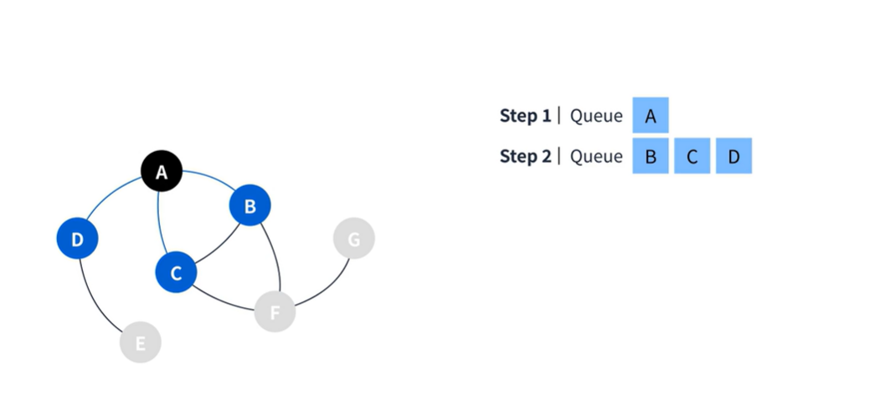  

Step 3 : Queue C D F  
  B정점을 디큐하고 B에서부터 이동가능한 정점을 큐에 넣는다. 이때 C는 이미 방문한 곳이기때문에 추가하지 않는다.
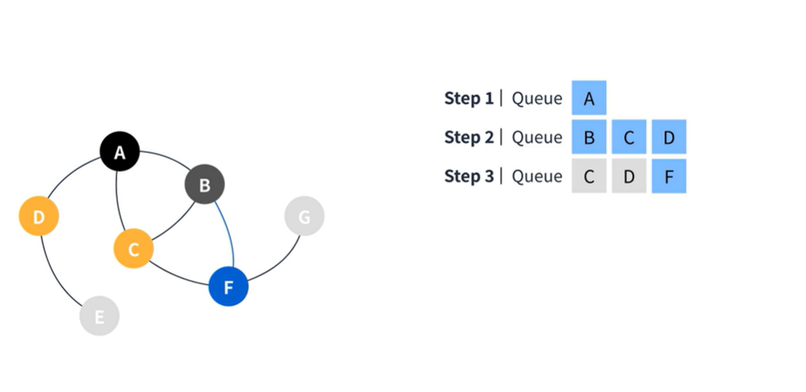

Step 4 : Queue  D F  
C정점을 디큐하고 C정점에서 F정점으로 이동할 수 있지만 이미 추가되었기 때문에 아무것도 하지않고 종료한다.
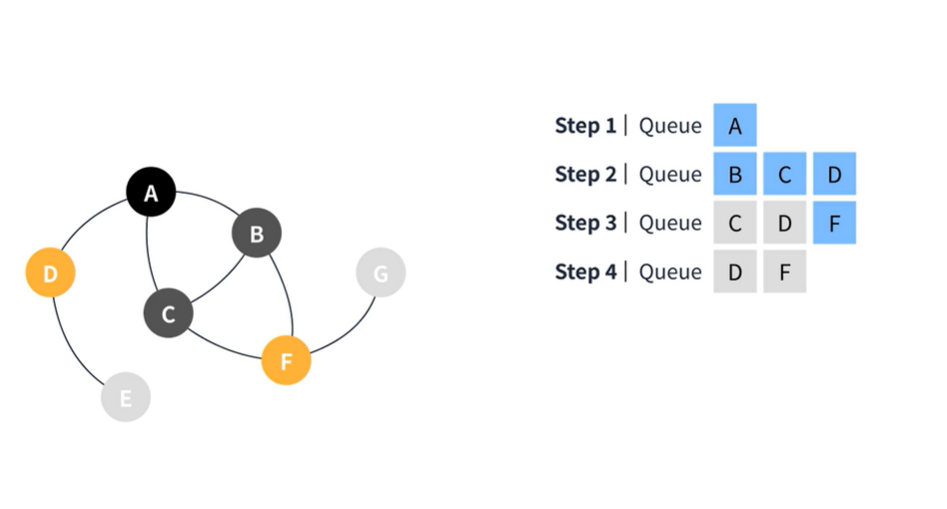  

Step 5 : Queue  F E  
F를 디큐하고 G정점을 큐에 넣는다
Steap 6 : Queue  E G  
E정점은 더이상 추가할 정점이 존재하지 않기때문에 디큐만하고 종료한다.
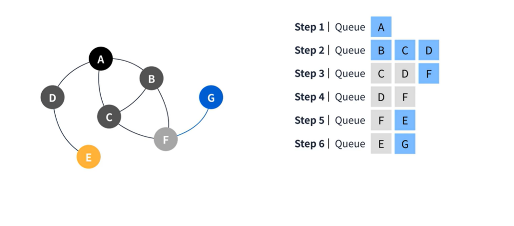

Step 7 : Queue  G  
G도 더이상 추가할 정점이 존재하지않기 때문에 디큐만하고 종료한다.
Step 8 : Queue  

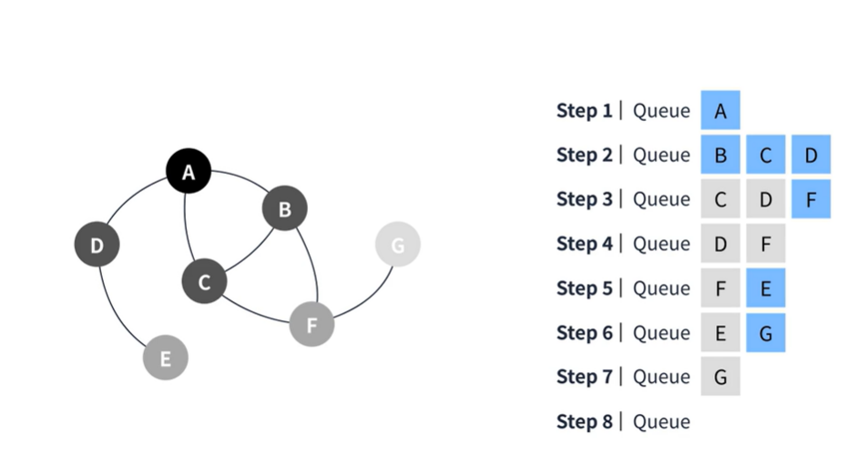  
#### BFS는 시작지점에서 인접한 요소부터 탐색하며 진행된다.

## Depth-First Search(깊이 우선 탐색)
그래프 탐색 알고리즘으로 최대한 깊은 정점부터 탐색하는 알고리즘  
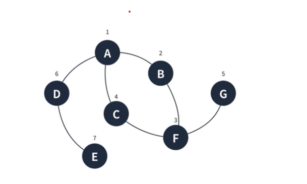  
  
#### DFS의 특징  
1. Stack을 이용하여 구현할 수 있다.
2. 시작 정점에서 깊은 것 부터 찾는다.
3. V가 정점의수, E가 간선의 수일 때 BFS의 시간복잡도는 O(V+E)다.  
  
  
Step 1: Stack : A  
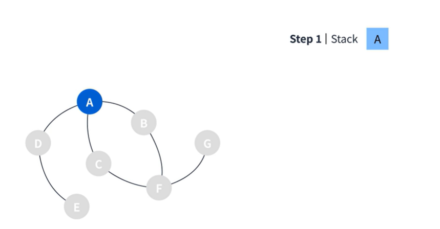  

Step 2: Stack : A B  
Stack의 탑인 A에서 이동할 수 있는 정점 B를 추가한다.
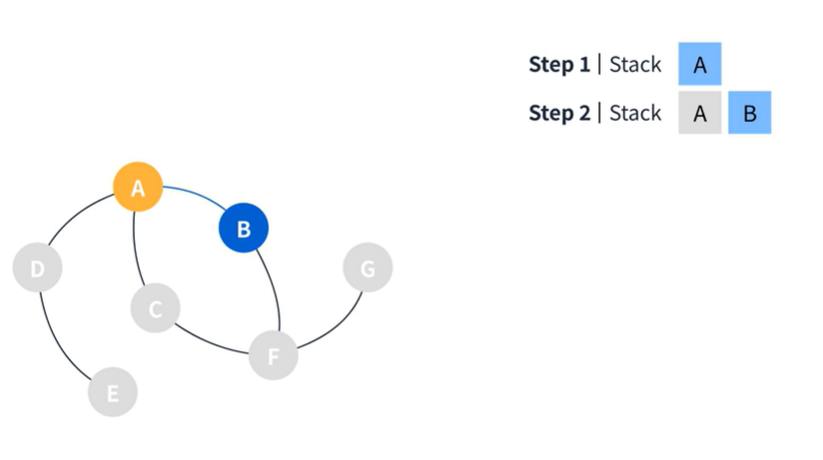  

Step 3: Stack : A B F 
Stack의 탑인 B를 참고하여 이동할 수 있는 정점 F를 추가한다.
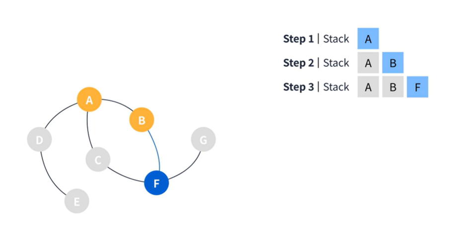  
  
Step 4: Stack : A B F C 
Stack의 탑인 F를 참고하여 이동할 수 있는 정점 C를 추가한다.
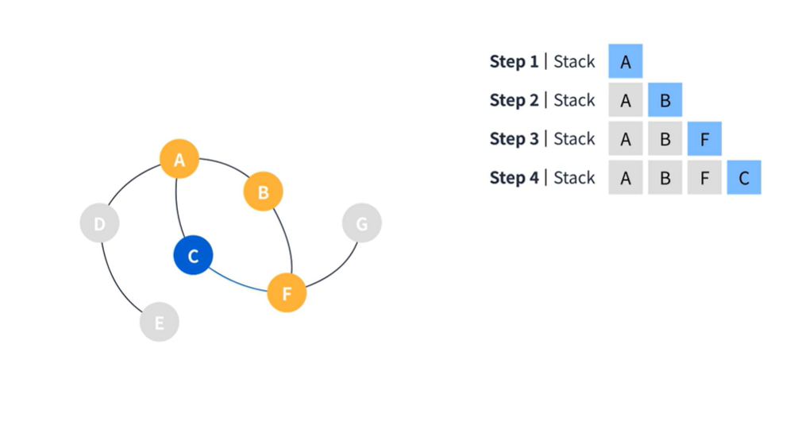  
  
Step 5: Stack : A B F G 
C에서는 더이상 갈곳이 없기때문에 Pop 하고 F에서 갈 수 있는 정정인 G를 추가한다.
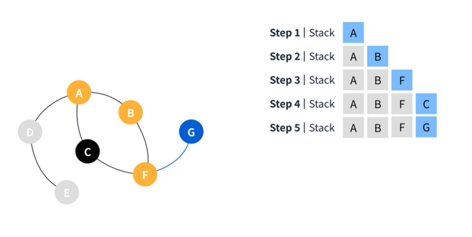  
  
Step 6: Stack : A  
G에서는 더이상 갈 수 있는 곳이 없기 때문에 그대로 Pop한다.  
나머지 F와 B도 더이상 갈 수 있는 곳이 없기 때문에 A까지 그대로 Pop 하게 된다.
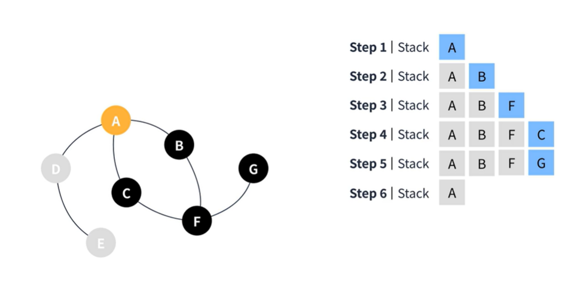  
  
 Step 7: Stack : A  D
 Step 8: Stack : A  D  E
 Step 9: Stack : 
다시 A부터 시작해서 D와 E를 스택에 추가한다.  
E에서 더이상 갈 수 있는 정점이 없기때문에 Pop하고 D도 마찬가지로 같은 이유로 Pop한다.
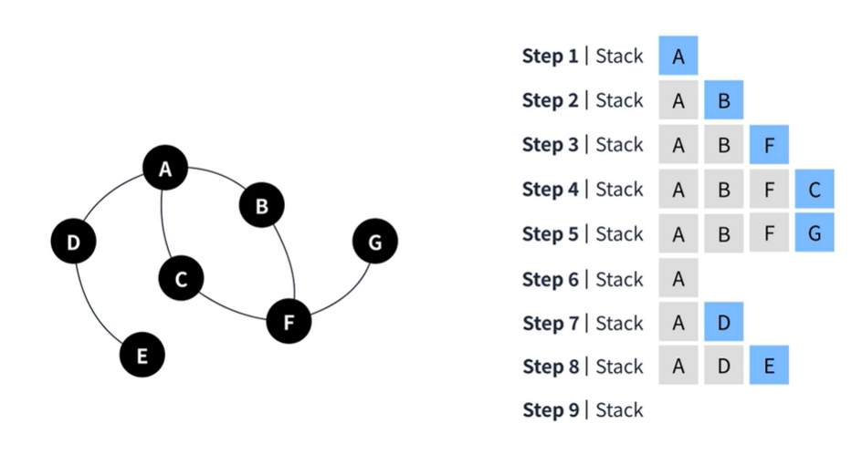  
  
 
```
const BFS = (graph, startNode) => {
    const visited = [startNode];
    const queue = [];
    queue.push(startNode);

    while(queue.length){
        const node = queue.shift() - 1;
        // 주변탐색
        graph[node].forEach(line => {
            if (!visited[line - 1]) {
                queue.push(line);
                // 루트 노드에서 얼마나 떨어져있는지 확인
                visited[line - 1] = visited[node] + 1;
            }
        });
    }

    return visited;
}


```