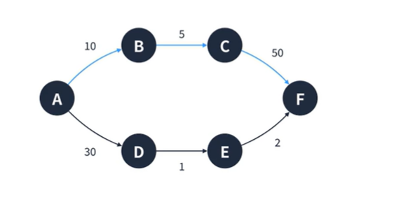
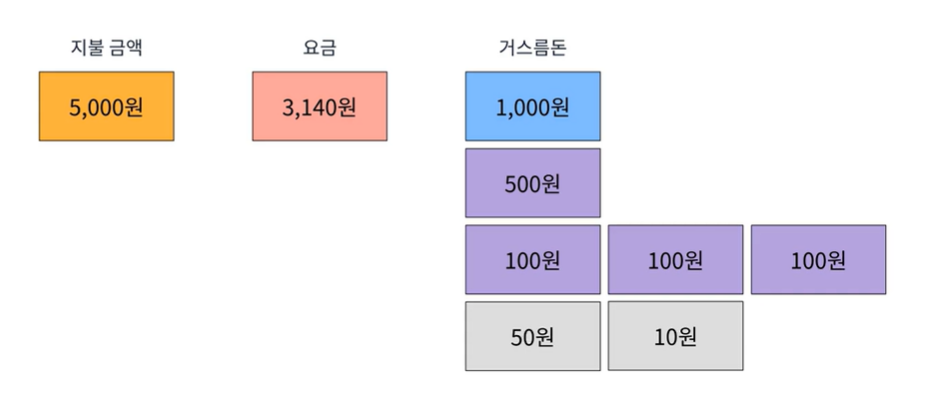

## 그리디
매 선택에서 지금 이 순간 가장 최적인 답을 선택하는 알고리즘  
최적해를 보장해주지 않는다.  

  
A로부터 갈 수 있는 정점은 B와 D가 있다.  
A가 볼때는 D보다 B가 가깝기 때문에 B를 선택한다.  
이어서 C,F를 이동하면서 총 이동거리는 65가 된다.  
하지만 최적해는 D를 선택했을떄 이다.  
D를 선택하게 되면 33이다.  
  
#### 그리디 알고리즘의 특징
1. 보통 최적해를 구하는 알고리즘보다 빠른 경우가 많다.
2. 크루스칼, 다익스트라 알고리즘 등에 사용된다.
3. 직관적인 문제 풀이에 적합하다.  
  
#### 동전 반환 문제
거스름돈은 번거롭기 때문에 최대한 큰 단위로 거슬러 주고 싶다.  
어떻게 해야할까??
```
    지불 금액 : 5,000원
    요금      : 3,140원
    거스름돈   : 1,860원
```  
  
참고로 이때 조심해야할 점은 **그리드는 특정 구현방법이 존재하는 것이 아닌 하나의 개념으로써 이해해야 한다.**
