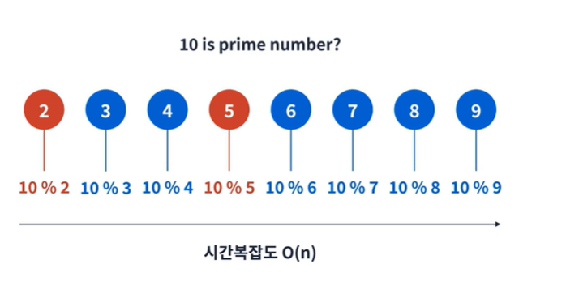
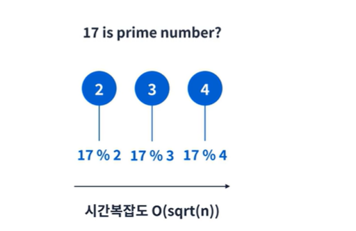
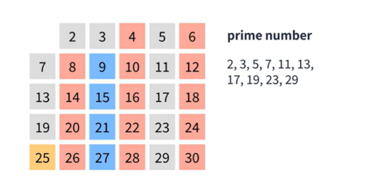
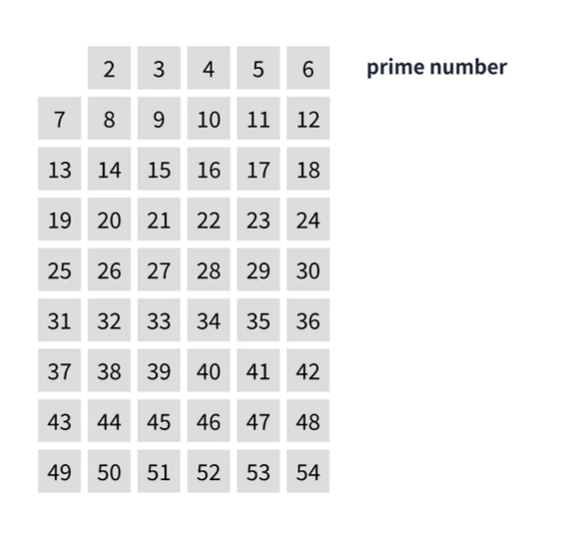
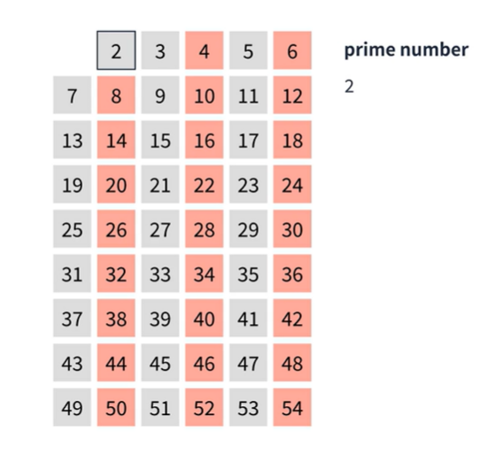
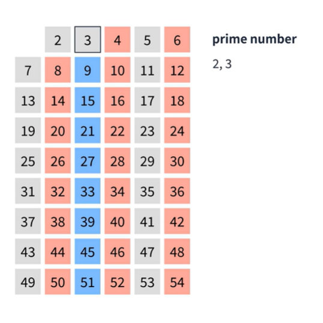
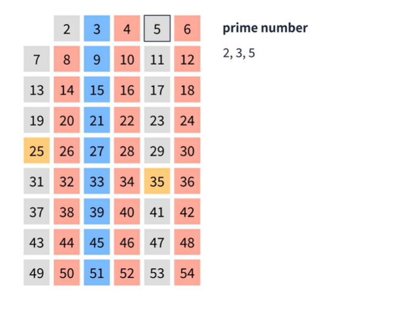
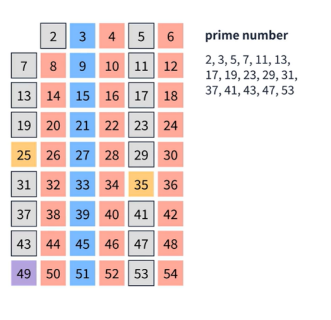

## 소수구하기
소수는 1 또는 자기 자신만을 약수로 가지는 수를 의미한다.  
  
#### 소수를 구하는 가장 효율적인 방법은 무엇일까??
1.가장 직관적인 방법  
2부터 N-1까지 루프를 돌며 나눠 보기  
  
```
    function is_prim(num){
        for(let i = 2; i< num; i++){
          if( num % i == 0){
            return false;
          }
        }
     return true;
    }
    // 다른 방법들에 비해 느린편에 속한다.
```  
  
2.효율성 개선하기  
그 어떤 소수도 N의 제곱근보다 큰 수로 나눠지지 않는 다는 점을 이용!  
  
```
    function is_prim(num){
        for(let i = 2; i * i <= num; i++){
          if( num % i == 0){
            return false;
          }
        }
     return true;
    }
    // 이전 방법보다 효율적이다.
```  
  
3.에라토스테네스의 체  
고대 그리스 수학자 에라토스테네스가 발견한 소수를 찾는 방법  
  
  
####2에서 54중 소수를 찾아보자
  
  
1. 먼저 앞에서 부터 숫자를 확인한다. 2를 선택한후 2의 배수가되는 수를 표시한다.
     
2. 3을 선택한다음 3의 배수가 되는 수를 체크한다.
    
3. 4는 이미 체크가 되어있기때문에 5를 선택한 후 5의 배수를 체크한다.
    
4. 이와 같은 방식으로 체크한 숫자는 건너 뛰면서 숫자를 체크한다.
이때 이전 알고리즘에서 n의 제곱근 보다 큰수로는 나누어지지 않는다는 것을 알고있다. 따라서 8부터는 확인할 필요가 없다.  
    
```
    // 에라토스테네스의 체
    // O(n log n)
    function get_primes(num){
    const prime = [false,false,...Array(num-1).fill(true)];
    
    for (let i = 2; i* i <= num; i++){
        if(prime[i]) {
            for( let j = i * 2; j<= num; j += i) {
                prime[j] = false;
            }
        }
    }
    return prime.filter(Boolean);
}    
```
