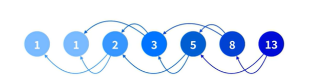
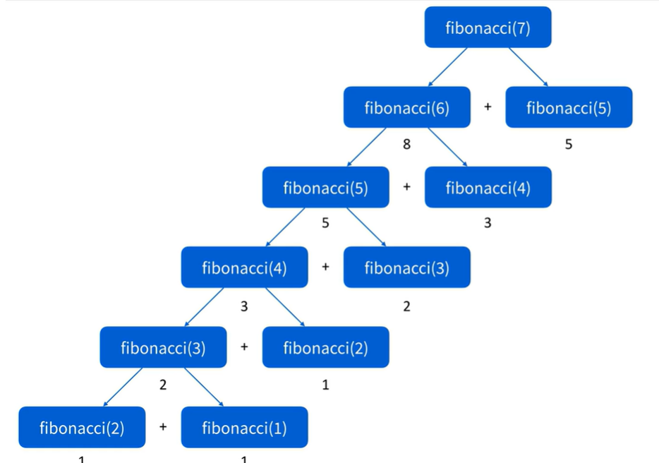
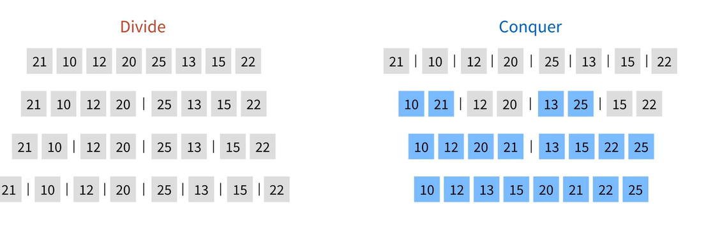

## 재귀함수
1. 재귀 함수는 자기 자신을 호출하는 함수를 말합니다.
2. 자기 자신을 호출하는 것을 재귀 호출(Recursion call) 이라고 합니다.
3. 함수 호출은 Call Stack에 쌓이기 때문에 스택 자료구조와 유사하게 동작합니다.
4. 함수형 프로그래밍에선 루프 구현을 재귀로 구현하는 경우가 많습니다.
5. 잘못 작성하면 무한 루프에 빠질 수 있습니다.

#### 자바스크립트에서 재귀 함수
1. 콜 스택에 제한이 있습니다.  
자바스크립트 엔진마다 제한 수는 다릅니다.  
따라서 브라우저마다 다르지만 크롬의 경우 약 1만개 입니다.
2. 꼬리 재귀(Tail recursion)가 제공되지 않습니다.
3. 성능이 좋지 않습니다.  
  
#### 그럼에도 불구하고 재귀를 알아둬야 하는 이유는??
재귀로 작성해야만 쉽게 풀리는 코딩 테스트 문제가 있기 때문(더 효율적인 것은 아님)  
  
#### 재귀로 구현해야 편한 알고리즘
1. Union-Find
2. DFS
3. Backtracking
4. 불편함을 무시한다면 더 빠른 성능으로(JS에서) 작성할 수 있지만 코딩 테스트는 빨리 푸는 것이 중요하기에 추천하지 않는다.  
  
#### 재귀함수 예시
```
    // 재귀호출
    function recursion(a){
    // 탈출 코드가 없으면 무한 루프에 빠진다.
        return recursion(a+1);
    }        
```  
재귀 함수를 작성할 때는 반드시 탈출 할 수 있는 조건을 작성해야 한다.  

```
    // 재귀호출
    function recursion(a){
        if(a > 10){
        // 무한 루프 방지를 위해 탈출 코드를 작성해야한다.
            return a;
        }                        
        return recursion(a+1);
    }     
console.log(recursion(5));       
```    
반드시 if등 조건을 통해 탈출한다.  
  
#### 피보나치 수열
앞 두 항의 합이 뒤 항의 값이 되는 수열  
  
  
```
// 피나보치 수열
// 1 1 2 3 5 8 13
function fibonacci(x){
    if (x <=2 ) {
        return 1
    }        
    return fibonacci(x - 1) + fibonacci(x - 2)
}
console.log(fibonacci(7)) // 13    
```    
  
  
#### 변수 없는 합병 정렬 구현
합병 정렬이 헷갈리신 다면 **정렬** 부분을 참고  
  
```
// 합병 정렬
const merge = (a, b) => {
    if(a.length === 0) return b;
    else if (b.length === 0) return a;
    else if(a[0] < b[0]) return [a[0], ...merge(a.slice(1), b)];
    else return [b[0], ...merge(a,b.slice(1))];
};

// 분해
const mergesort = (arr) => {
    if (arr.length < 2) return arr;
    else {
        const mid = Math.floor(arr.length / 2);
        return merge(mergesort(arr.slice(0, mid)), mergesort(arr.slice(mid)));
    }
};
console.log(mergesort([21,10,12,20,25,13,15,22])); //[10, 12, 13, 15, 20, 21, 22, 25]

```
  
