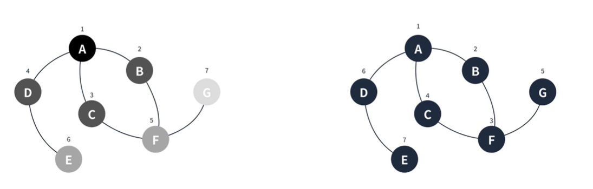
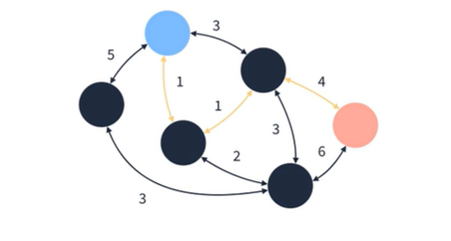
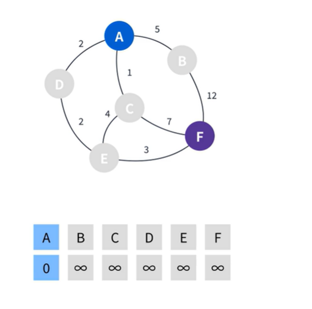
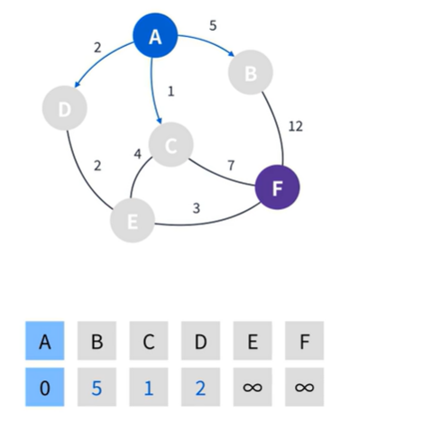
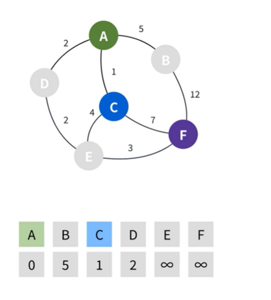
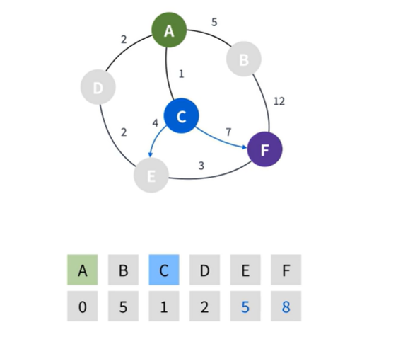
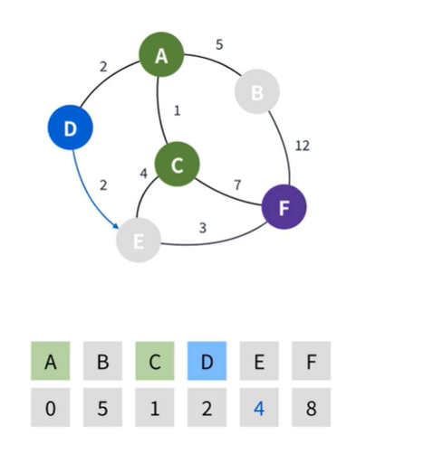
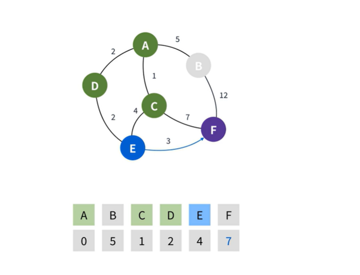
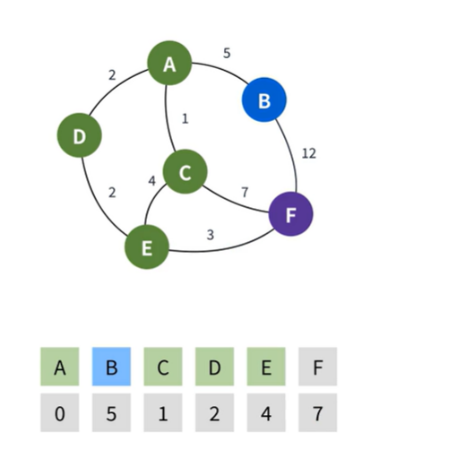

## 최단 경로 알고리즘(Dijkstra)  
1. 그래프에서 특정 정점에서 목적지까지 최단 경로를 구하는 알고리즘
2. 이전에 배운 BFS, DFS도 최단 경로 알고리즘으로 사용할 수 있다.
3. 대표적인 최단 경로 알고리즘으로 다음과 같은 알고리즘이 있다.
3.1. BFS  
3.2. 다익스트라(Dijkstra)   
3.3. 벨만- 포드(Bellman-Ford's)  
3.4. 플로이드 와샬(Floyd Warshall)  
4. 목적에 따라 알고리즘을 선택할 수 있다.  
  
## BFS, DFS
그래프의 간선 가중치가 모드 같을때 적합하디.  
  
  
  
## Dijkstra
그래프의 간선 가중치가 각각 다른 경우 적합하다.  
  
  
1. Edsger Wybe Dijkstra가 고안한 최단 경로 알고리즘
2. 원래 발음은 데이크스트라에 가깝다고 한다.
3. 우선순위 큐를 이용하여 만들 수 있다.
4. 시간복잡도는 V가 정점의 수, E가 간선의 수일때 O(E log V)다.  

1.
  
시작점을 제외한 나머지 정점의 거리는 무한으로 초기화 한다. 
여기서 시작점의 거리는 0으로 설정한다.  

2.
  
시작점에서 갈 수 있는 정점을 찾는다.  
그리고 나서 각 정점의 가중치를 더한다.  

3.
  
설정한 정점중 가장 최단거리에 위치한 정점을 선택한다.  
여기서는 `C`가 `1`로 가장 작기에 `C`가 선택됩니다.  

4.

`C`에서 갈 수 있는 정점을 찾고 가중치를 더해준다.  
`C`에서 갈 수 있는 정점은 `E`와 `F`가 있고 `C`의 가중치 `1` 과 각각 `4` 와 `7`을 더한다. 
`C`는 방문처리한다.  

5.
    
`C`다음으로 작은 정점인 `D`로 이동한다.
`D`에서 갈 수 있는 정점은 `E` 밖에 없습니다.  
`E`는 이미 값을 가지고 있지만 `D`에서 가는 가중치의 합이 더 작기때문에 `4`로 업데이트 하고  
`D`를 방문처리 한다.  

6.
 
다음으로 작은 정점인 `E`가 선택된다.  
`E`에서 갈 수 있는 정점은 `F`밖에 없기에 `F`로 가는 거리를 계산합니다.  
계산 결과 가중치가 더 작기 때문에 `7`로 업데이하고 `E`를 방문 처리한다.  
  
7.
  
도착점을 제외한 마지막 정점 `B`로 이동한다.  
`B`에서 갈 수 있는 정점은 `F`밖에 없다  
이번에는 계산한 가중치가 `F`의 값보다 크기 때문에 업데이트 하지 않고  
`B`를 방문 처리한다.  
마지막으로 도착지점인 `F`의 값을 확인해보면 최단 거리인 `7`을 확인할 수 있다.  
  
다익스트라 알고리즘의 흐름을 보면 알 수 있듯이 가장 낮은 정점을 계속해서 선택해야된다.  
#### 따라서 다익스트라 알고리즘의 핵심은 우선순위 큐!  
  
#### 정리
1. 시작점을 제외한 모든 정점의 거리를 무한으로 설정, 시작점은 0으로 설정
2. 시작점을 선택
3. 선택한 정점에서 갈수 있는 정점의 거리를  
**정점(해당 정점까지 최단 거리)값 + 간선(거리)** 값으로 갱신한다.  
4. 선택한 정점을 방문 처리한다.
5. 이미 방문한 정점과 무한인 정점을 제외하고 **가장 최단 거리인 정점을** 선택한다.  
6. 더 이상 방문할 수 있는 정점이 ㅇ벗을 때 까지 3~5를 반복한다.
7. 도착점의 값을 확인한다.

