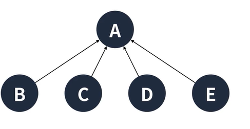

  
**최소한의 비용**으로 **모든 정점을 연결**하려면???  
생각보다 간단하다. 바로 필요한 간선 외에는 전부 제거한다!!  
  
  
  
## 최소 신장 트리란?
1. 신장 트리(Spanning tree)란 그래프 내에 모든 정점을 포함하는 최소 연결 부분 그래프다.  
2. 여기서 최소 신장 트리(MST)는 다음과 같은 조건을 만족한다.  
2.1. 최소한의 간선으로 모든 정점이 연결되어야한다.  
2.2. 모든 신장 트리 중 가중치의 값이 최소여야 한다.  
2.3. Cycle이 발생해서는 안된다.  
3. 최소 신장 트리를 위한 알고리즘은 대표적으로 두가지가 있다.  
3.1. 크루스칼(Kruskal) <- 이번 목표  
3.2. 프림(Prim)    
  
## 미리 알아두는 크루스칼 알고리즘
1. 그리디 개념을 이용하여 구현할 수 있다.  
2. 먼저 모든 그래프를 부분 집합으로 분리한다.  
3. 가장 가중치가 낮은 간선을 선택하고 부분 집합을 연결한다.  
4. 이때, Cycle이 발생하지 않도록 주의한다.  
4.1. 공통 최상위 부모를 찾는 것으로 막을 수 있다.  
4.2. Cycle을 판단하기 위한 알고리즘으로 Union-Find 알고리즘을 이용할 수 있다.  
  
  
## Union-Find 알고리즘이란?
1. 서로소 집합을 구하기 위한 알고리즘  
1.1 서로소 집한은 **공통 원소가 없는 두 집합**을 표현하기 위한 자료구조
2. 서로 다른 두 집합을 병합하는 연산 **Union**과 집합의 원소가 어떤 집합에 속해 있는지 판단하는 연산 **Find**를 나타낸다.
3. 보통 트리 구조로 구성한다.
4. 편의상 재귀로 구현하는 경우가 많다.  
  
## Union(두 집합의 병합)  
초기에는 자기 자신을 부모 정점으로 설정한다(자기 자신 = 자신이 속한 집합)  
여기서 Key는 원소 Value는 자신이 속한 집합의 부모 정점이라고 생각하면 된다.  
  
  
1.`B`가 `A`에 속할 경우  
`B`의 부모 원소를 `A`로 바꿔준다. 이러면 두원소는 같은 집합이 된다.
    
  
2.`D`가 `B`에 속할 경우  
`D`의 부모를 B의 부모인 `A`로 지정  
즉 집합의 최상위 원소를 부모로 지정한다는 의미
  
  
3.`E`가 `C`에 속할 경우  
`E`의 부모가 `C`가 된다.
  
  
4.`E`가 `B`에도 속할 경우  
`C`와 `E`가 속한 집합의 최상위 원소인 C의 부모를 `A`,`B`,`D`가 속한 최상위 원소인 `A`로 지정한다.  
이런식으로 두 집합을 하나의 집합으로 합쳐 줄 수 있다.
  
  
5.그런데 해당 구조만으론 각 원소가 어떤 집합에 속한지 알 수 없다.  
즉 데이터만으로는 구분하기가 힘들다 그래서 **Find**연산이 필요하다.
  
  
  
## Find(어떤 집합에 속해 있는지 판단하는 연산)  
  
1.가장 간단한 방법은 parent(부모 원소)가 자기 자신일때 까지 올라가기  
예를 `E`가 속한 집합에 최상위 원소를 찾을때 `C`를 거처 `A`를 보면 최상위 원소를 알 수 있다.  
만약 두원소의 가 같은 집합인지 알고 싶으면 두 원소의 최상위 원소가 같은지 확인하면 된다.
  
하지만 만약 편향 트리라면 O(N)이 소요된다.  
  
  
#### 따라서 이부분에 대한 최적화 즉, 경로 압축을 통한 최적화가 필요하다!  
  
## 경로 압축
어차피 타고 올라가다 보면 최종 공통 부모를 알 수 있다.  
  
  
만약 재귀로 구현했다면 돌아오면서 부모 값을 변경해준다.  
  
  
그려면 자연스럽게 경로가 최적화된다.  
  
  
  
## Kruskal  
먼저 크루스칼 알고리즘을 시작하기전에 데이터를 간선과 서로소 집합으로 구성한다.  
  
  
먼저 가장 가중치가 낮은 간선을 선택하고 두정점을 한 집합으로 이어준다.  
  
  
그담으로 가중치가 낮은`A`,`B` 간선을 선택하고 두 정점을 한 집합으로 이어준다.  
그러면 `A`,`B`,`D`가 한 집합이 된다.
  
  
이번에는 `B`,`C`간선을 선택하고 두 집합을 이어준다.  
  
  
`B`,`F`간선을 선택하고 두 집합을 이어준다.  
  
  
`A`,`C`간선을 선택하고 두 정점을 합쳐주려 하지만 Cycle이 발생하는 구조이다.  
여기서 두정점의 최상위 원소가 같다면 이미 같은 집합에 소속되어 있다는 의미이기 때문에  
Cycle이 발생한다. 따라서 해당 간선을 패스 한다.
  
  
`F`,`G` 간선을 선택한다.  
Cycle이 발생하지 않기때문에 그대로 합쳐준다.
  
  
`D`,`E` 간선을 선택한다.  
여기까지 오면 모든 정점이 한집합으로 구성되었다는 것을 알 수 있다.
  
  
그래도 진행해보자면 `E`,`F` 간선은 Cycle이 발생하기때문에 패스한다.  
마찬가지로 `C`,`F`간선도 같은 이유로 패스한다.
  
  
이렇게 패스한 간선을 모두 제외하면 최소신장 트리가 구성된다.  
  
  
  
## 정리
1. 가장 가중치가 낮은 간선부터 선택하는 것 = Greedy
2. 각 원소가 같은 집합인지 확인하기 위한 알고리즘 = Union-Find
3. 두 정점이 같은 집합에 속한다면 = Cycle

