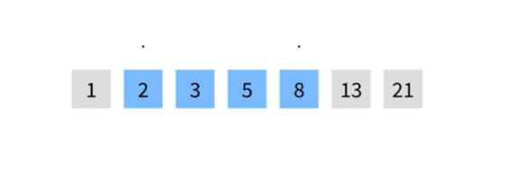
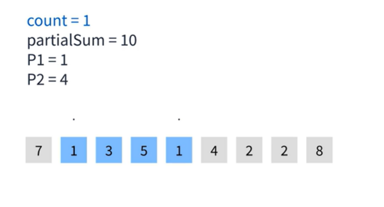

## 투포인터 알고리즘이란?
1. 일차원 배열에 두 개의 포인터를 두고 조작하는 알고리즘  
즉, 인덱스를 가리키는 두개의 변수(포인터)를 지정해주면 된다.
2. 보통 연속적인 구간에 대한 계산을 할때 많이 사용한다.  

   
  
## 다음 배열에서 합이 10인 수열의 수는??(구간합 문제)
   
  
1.처음에는 포인터 두개가 첫인덱스를 가리킨다.  
이때는 아직 합이 `7`이고 합이 `10`인 경우는 1개도 못찾은 상태이다.
   
  
2.두 구간의 합이 `10`을 넘지 않았기 때문에 두번째 포인터를 `1`증가시키고  
해당 인덱스가 가리키는 값들 더해준다.  
   
  
3.구간합이 `10`을 넘지 않았기 때문에 두번째 포인터를 증가시킨다.  
이제 구간합이 `11`이 된다.
   
  
4.구간합이 `10`을 넘었기 때문에 반대로 첫번째 포인터를 증가 시킨다.  
포인터를 증가시키면서 기존 값을 `partialSum` 에서 빼준다.
   
  
5.이번에는 두번째 포인터를 증가시키고 구간합도 더해준다.  
   
  
6.역시 두번째 포인터를 증가시키고 구간합을 더해준다.  
이번에는 구간합이 10이 되었기 때문에 `count` 변수를 증가 시켜준다.  
   
  
7.두번째 포인터를 증가시켜주고 구간합을 더해준다.  
   
  
8.구간합이 `10`보다 크기때문에 첫번째 포인터를 증가시켜주고  
해당 인덱스의 값을 구간합에서 빼준다.
   
  
9.`10`보다 크기때문에 첫번째 포인터를 증가시키고 해당 인덱스를 구간합에서 빼준다.  
이때 구간합이 `10`이 되었기 때문에 `count`를 증가 시켜준다.  
   
  
10.이런식으로 해당 규칙으로 반복한다.  
이때 두번째 포인터가 배열의 끝에 도달하면 그 이후에는 첫번째 포인터를 계속 증가시켜주면서  
구간합이 `10`이 되면 `count`변수를 증가 시켜준다.  
첫번째 포인터와 두번째 포인터가 모두 배열 끝에 도달하면 투포인터 알고리즘이 종료된다.  
  
## 정리
1. 어려운 개념은 아니지만 모를 때는 당하는 문제 유형
2. 백트래킹을 사용하거나 완전 탐색으로 풀려다 시간 제한에 걸리는 경우가 많다.
3. 따라서 이런 유형도 있다고 알아두는 것이 좋다.