## 백트래킹 이란?
1. 모든 경우의 수를 탐색하는 알고리즘
2. DFS나 BFS를 이용할 수 있다.
3. 효율을 위해 탐색하지 않아도 되는 곳을 미리 막는 것을 가지치기(Pruning)라고 한다.
4. 자바스크립트는 재귀 효율이 나쁘기 때문에 DFS를 구현할 경우 스택을 이용하는 것이 좋다.  
코딩 테스트에선 이를 고려하여 재귀로 작성해도 풀 수 있도록 문제를 제출하는 경우도 있다.  
5. 탐색에서 순환(Cycle)이 발생할 수 있다면 BFS를 이용하는 것이 편하다.  
  
## BFS, DFS
모든 경우의 수를 찾을 때도 사용한다.  
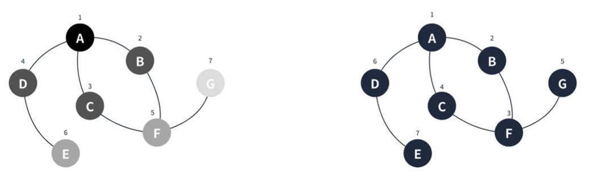  

#### 백트래킹의 핵심은 기지치기! 가지치기를 얼마나 잘하느냐가 효율성을 결정한다.  
  
## 어떻게 작성할 것인가?
1. 우선 모든 경우의 수를 찾을 수 있도록 코딩
2. 이후 문제에서 특정한 조건을 만족하는 것만 탐색하고 나머지는 탐색하지 않도록 조건문을 작성한다.
3. 즉, 절대로 답이 될 수 없는 것은 탐색을 종료한다.  
  
## N-Queen 문제
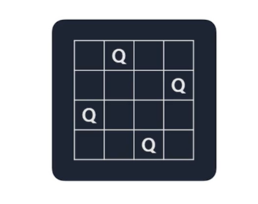  

길이가 `N`인 체스판 위에 `N`개의 퀸이 서로를 공격할 수 없도록 배치할 수 있는 경우의 수는?? 

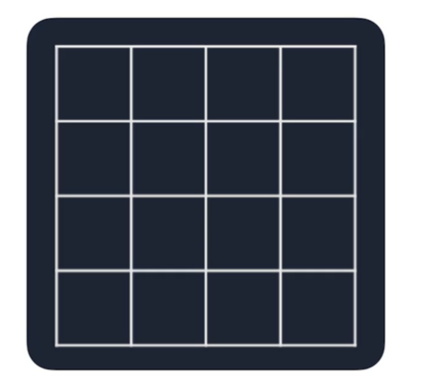  
  
백트래킹은 모든 경우의 수를 찾아야 하기에 일단 하고본다.  

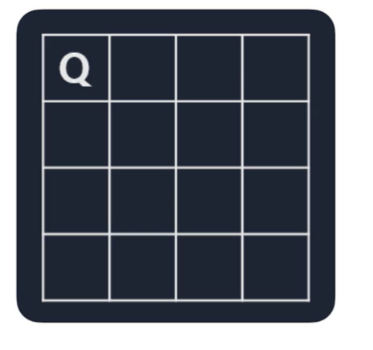  
  
1,1 에 퀸을 배치  

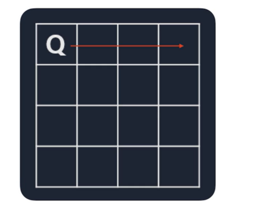  
  
첫 줄은 더이상 퀸을 둘 수 없기에 다음 줄로 이동  

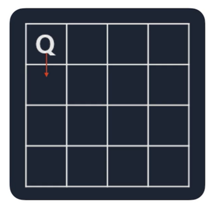  
  
두 번째 줄 첫 칸은 둘 수 없기에 패스  

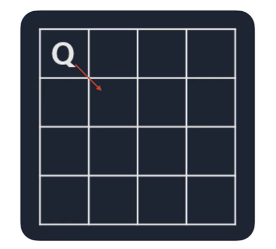  
  
두 번째 줄 두번째 칸은 둘 수 없기에 패스  

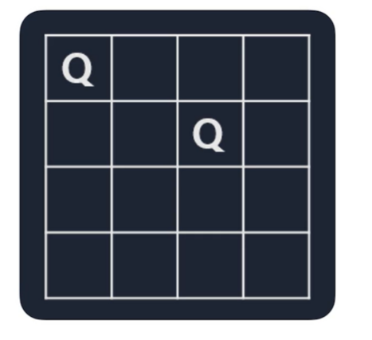  
  
두 번째 줄 세번째 칸은 퀸 배치가 가능하다.  

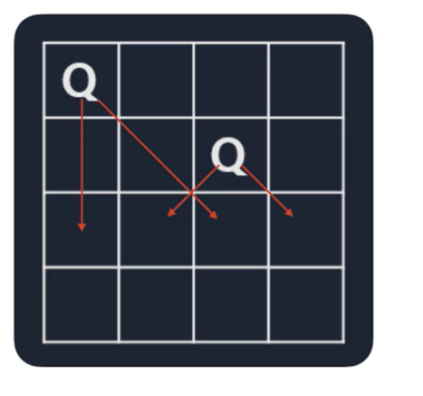  
  
세 번째 줄에서 더 이상 퀸을 둘 수 없어서 이후 탐색은 제외한다.  

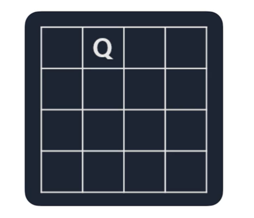  
다시 처음으로 돌아와서  이번엔 1,2 에 둬본다.  

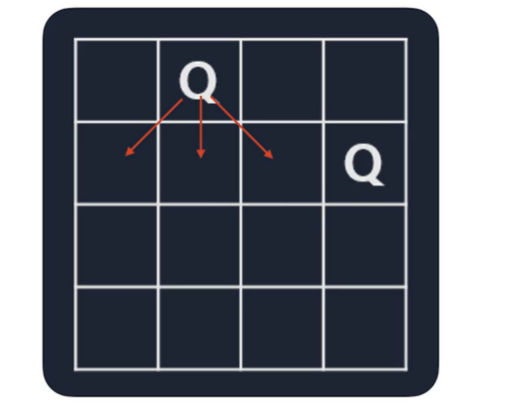  
안되는 곳은 패스하고 되는 곳에 둔다.  

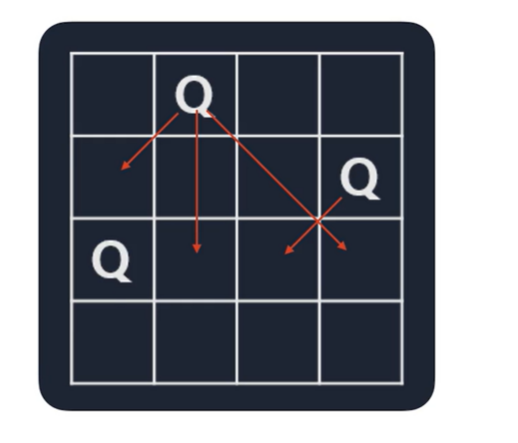  
세 번째 줄에서도 안되는 곳은 패스하고 되는 곳에 둔다.  

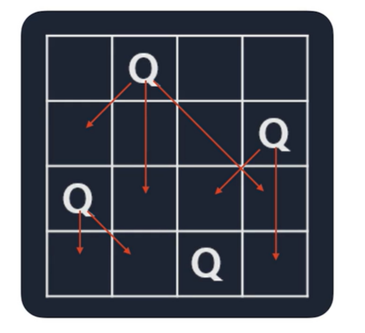  
결과적으로 `N`개의 퀸을 배치할 수 있는 경우의 수를 찾았다.

