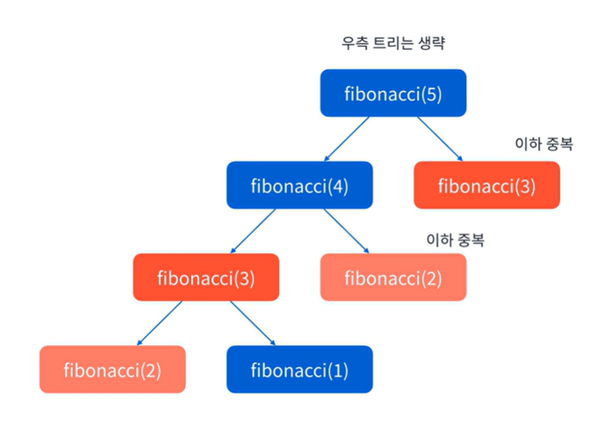

## 동적 계획법 이란?
1. 해결한 작은 문제로 큰 문제를 해결하는 문제 풀이 방식
2. 그리디나 백트래킹처럼 특정 알고리즘이 아닌 문제 행결 방식을 의미한다.
3. Dynamic Programming(DP) 이라고 부른다.  
동적 계획법이 어렵게 느껴지는 원인 중 하나  
Dynamic 하지 않고 Programming 과도 관련이 없다.
4. 메모리를 많이 사용하는 대신 빠른 성능을 자랑한다.
5. 두가지 방법론이 있다.  
메모이제이션(Memoization), 타뷸레이션(Tabulation)  
  
## 메모이제이션
1. 하향식 접근법
2. 동적 계획법에서 작은 문제들의 결과는 항상 같다.
3. 따라서 이 결과들을 메모리에 저장해 필요할 때 꺼내 쓰는 것이 메모이제이션이다. 
4. 즉 작은 문제를 저장해 두었다가 꺼내 쓴다  

  

####우선 백트래킹을 이용한 피보나치 수열 구현은 중복되는 연산이 너무 많다.  
이미 한번 구한 결과도 중복해서 값을 구하기 때문에 구해야하는 수열이 뒤에 위치할 수록 시간이 오래걸린다.  
#### `즉, 이미 해결한 문제는 기록해두자 !! -> 메모이제이션`
이때 메모이제이션을 위해 피보나치 수열의 가장 작은 문제를 기록해 두어야한다.


## 피보나치 수열의 가장 작은 문제는??
```
    fibonacci(1) = 1
    fibonacci(2) = 1
```
정답은 피보나치 수열에 첫번째와 두번째이다.  
우리는 각값이 `1`이라는 것을 이미 알고 있다.  
  
#### 그러면 과연 작은 문제로 큰 문제를 해결할 수 있는가??
  
  
규칙이 있다면 가능하다!!  
```
    f(n) = f(n - 1) + f(n - 2)
```  
이전 두값을 더해주면 다음 값을 알 수 있다.  

  
  

## 타뷸레이션
1. 상향식 접근법
2. 필요한 값들을 미리 계산해두는 것
3. 메모이제이션은 필요할 때 계산한다면(Lazy evaluation)  
타뷸레이션은 미리 계산해둔다.(Eager evaluation)
4. 보통 코딩 테스트에선 메모이제이션을 쓰는 경우가 대부분이다.  

  
  
## 동적 계획법 문제 어떻게 접근할까?
1. 동적 계획법 유형은 키워드만으로 동적 계획법 문제임을 알기 어렵다.
2. 그렇기 때문에 문제 유형을 알 수 없다면 다음을 확인하자
3. **가장 작은 문제를 정의할 수 있는지?**
4. **작은 문제를 통해 큰 문제를 해결할 수 있는 규칙이 있는지?**
5. 위 두가지가 모두 가능하다면 동적 계획법 문제다.
6. 간혹 메모리를 너무 사용하여 통과 못하는 경우도 있다.  
이런 경우엔 백트래킹을 이용할 수 있지만 보통 코딩 테스트에서 자주 나오진 않는다.
  
