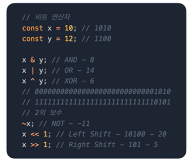

## 비트연산자
비트를 직접 조작하는 연산자.  
  
  
## 비트 마스크
1. 이진법 성질을 이용하여 문제를 해결하는 방법
2. 특정 알고리즘은 아니고 비트 연산을 이용한 일종의 코딩 기법
3. 이진수가 자료 구조로 사용된다.
4. 배열대신 이진수를 이용할 수 있다.  
ex) [true,false,false,true] = 13(1101)  
5. 굉장히 빠르고 메모리 사용량이 적다.
6. 그리디, 동적 계획법등, 다른 알고리즘과 함께 사용할 수 있다.  
  
  
## 비트를 배열(집합)처럼 사용하기
* false로 초기화 하기 -> bit = 0;
* N개 만큼 true로 초기화 하기 -> bit = (1<<N) - 1;
* i번째 요소 true로 바꾸기 -> bit |=(1<<i);
* i번째 요소 false로 바꾸기 -> bit &=~(1<<i);
* i번째 요소 토글하기 -> bit ^=(1<<i);
* i번째 요소가 true인지 체크하기 -> bit & (1<<i);  
  
  
## 두 집합끼리 연산하기
* 합집합 -> A|B;
* 교집합 -> A&B;
* A에서 B를 뺀 차집합 -> A&(~B);
* 합집합에서 교집합 제외(xor) -> A^B;  
  
## 주의할 점
1. 정수형 범위를 넘지 않도록 조심할 것(JS에서도 비트 연산은 정수 범위를 넘을 수 없다)
2. 연산자 우선 순위에 주의할 것