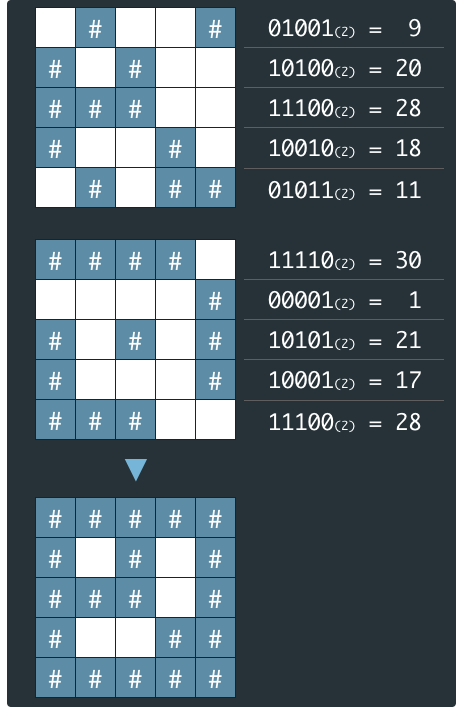

## 비밀지도 문제풀이
네오는 평소 프로도가 비상금을 숨겨놓는 장소를 알려줄 비밀지도를 손에 넣었다.  
그런데 이 비밀지도는 숫자로 암호화되어 있어 위치를 확인하기 위해서는 암호를 해독해야 한다.  
다행히 지도 암호를 해독할 방법을 적어놓은 메모도 함께 발견했다.  
1. 지도는 한 변의 길이가 n인 정사각형 배열 형태로, 각 칸은 "공백"(" ") 또는 "벽"("#") 두 종류로 이루어져 있다.
2. 전체 지도는 두 장의 지도를 겹쳐서 얻을 수 있다. 각각 "지도 1"과 "지도 2"라고 하자. 지도 1 또는 지도 2 중 어느 하나라도 벽인 부분은 전체 지도에서도 벽이다.  
지도 1과 지도 2에서 모두 공백인 부분은 전체 지도에서도 공백이다.
3. "지도 1"과 "지도 2"는 각각 정수 배열로 암호화되어 있다.
4. 암호화된 배열은 지도의 각 가로줄에서 벽 부분을 1, 공백 부분을 0으로 부호화했을 때 얻어지는 이진수에 해당하는 값의 배열이다.  

  
네오가 프로도의 비상금을 손에 넣을 수 있도록, 비밀지도의 암호를 해독하는 작업을 도와줄 프로그램을 작성하라.  

이 문제는 레벨 1 문제인 만큼 이미지부터 대놓고 이진법을 이용할 수 있다고 티를 내고 있습니다. 이 문제는 다음과 같은 흐름으로 풀 수 있습니다.  
  
1. 입력으로 들어오는 정수 두 개를 합집합(|) 연산한다.
2. 해당 값을 이진수 문자열로 변환한다.
3. 1을 #으로 0을 공백으로 변환한다.
4. n 길이에 맞춰 이진수 문자열이 짧다면 나머지를 공백으로 채운다.  
  
## 전체코드
```
function solution(n, arr1, arr2) {
    let answer = [];
    for (let i = 0; i < n; i += 1) {
        const result = arr1[i] | arr2[i]; // 합집합
        const bit = result.toString(2); // 이진수 문자열로 변환
        const blankString = ' '.repeat(n - bit.length); // 부족한 만큼 빈 문자열을 채운다
        const bitString = bit.replace(/1/gi, '#').replace(/0/gi, ' ') // 1을 #으로 0을 공백으로 바꾼다
        answer.push(blankString + bitString); // 빈 문자열과 비트 문자열을 합친다.
    }

    return answer; // 반환
}
```