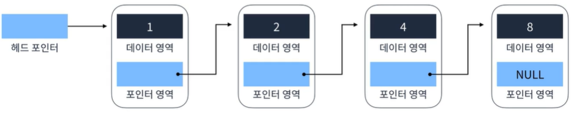
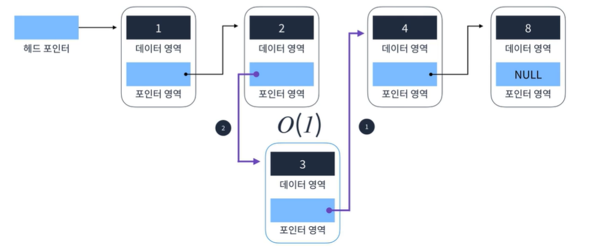
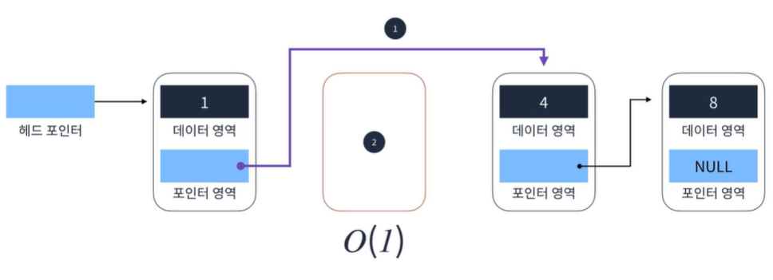

##Singly Linked List
Head(가장 첫번째 요소)에서 Tail(가장 마지막 요소)까지 단방향으로  
이어지는 연결리스트 가장 단순한 형태인 연결 리스트다.  
**헤드 포인터**는 Head를 가리키는 첫번째 출발점  
**Tail**요소의 포인터영역이 NULL 이다 즉, 포인터 영역이 NULL이면 더이상 갈 곳이 없다는 의미  
즉 연결리스트 끝을 의미한다.
#### 구조
  
  
  
#### 핵심 로직
1. 요소찾기  
2. 요소추가
3. 요소 삭제  
  
#### 요소 찾기(4를 찾자)
  
```
 1. 헤더 포인터에서 시작
 2. 헤더 포인터를 참고하여 다음 요소의 헤더를 찾는다.
 3. 해당 요소가 4인지 확인하고 아니면 포인터 영역을 통해 다음요소로 이동
 4. 해당 요소를 찾았다면 해당 값을 반환하고 로직을 처리한다. O(n)
```  
  
#### 요소 추가  
  
  
```
 1. 추가할 요소의 포인터 영역을 추가할 다음 요소의 데이터 영역을 가리킨다.
 2. 추가될 위치의 이전 요소의 포인터가 추가할 요소를 가리킨다 O(1) 
 이때 추가하는 부분만 상수시간이 소요되고 만약 2를 가지고있는 데이터나 4를 가지고 있는 데이터를
 탐색하게 된다면 탐색 로직이 수행되기때문에 선형시간이 소요된다.
 그래서 추가를 위한 탐색이 발생하지 않도록 로직을 작성해야된다.
```  
  
#### 요소 삭제  
  
```
 1. 삭제할 요소의 이전요소의 포인터를 삭제할 다음요소를 가리키게한다.
 2. 삭제할 요소를 메모리상에서 지운다. O(1)
```