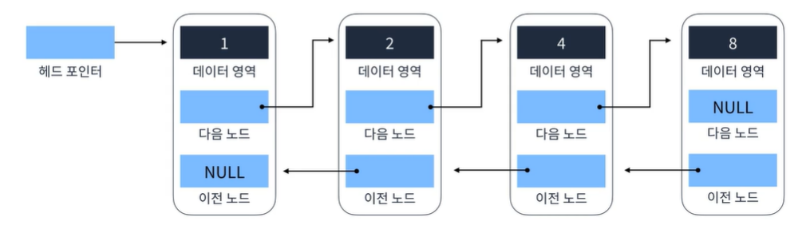
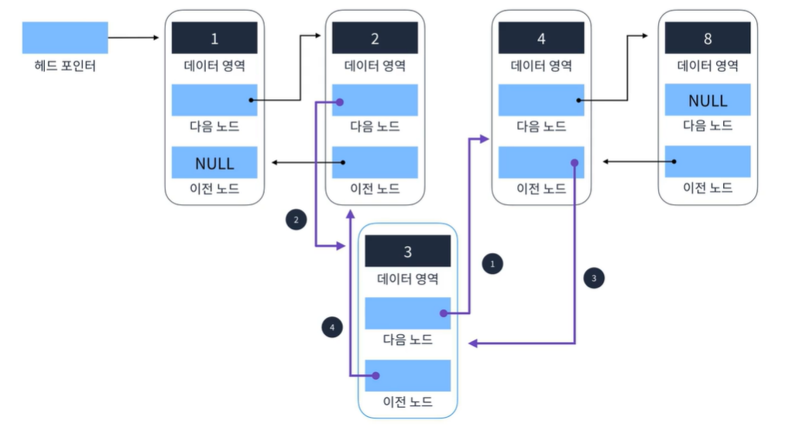
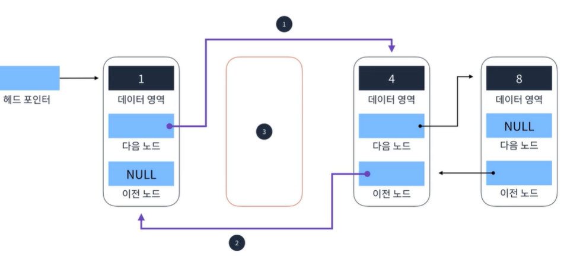

## Doubly Linked List
양방향으로 이어지는 연결리스트  
Singly Linked List보다 자료구조의 크기가 조금더 크다.  
이중 연결 리스트는 단일 연결리스트와는 다르게 포인터가 2개 존재한다.  
즉, 다음과 이전을 가리킬 수 있어서 **양방향으로** 이어지는 구조를 가지고 있다.  

  
  
#### 요소 추가  
  
  
```
 1. 추가할 요소의 다음요소를 4를(4를 가지고있는 요소) 가리키게한다
 2. 추가할 요소의 이전 요소에 다음을 추가될 요소를 가리키게 한다.
 3. 4를 가진 요소의 이전 요소를 추가될 요소를 가리키게한다.
 4. 추가할 요소의 이전을 2를 가지고있는 요소를 가리키게한다. O(1)

```  
  
#### 요소 삭제  
  
  
```
 1.삭제할 요소의 이전요소가 삭제할 요소의 다음요소를 가리키게한다.
 2. 삭제할 요소의 다음요소의 이전을 삭제할 요소의 이전 요소를 가리케가한다.
```