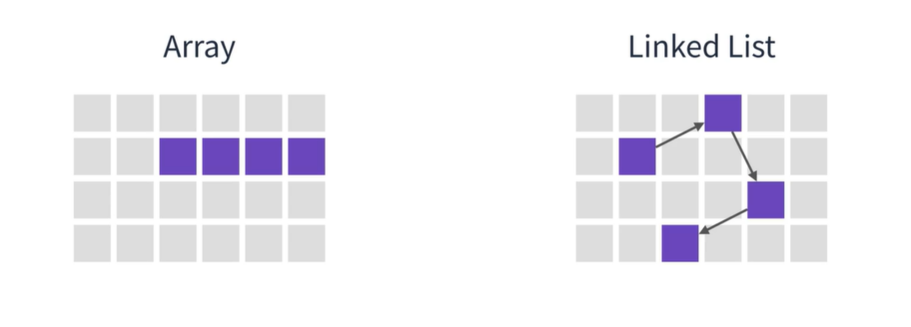
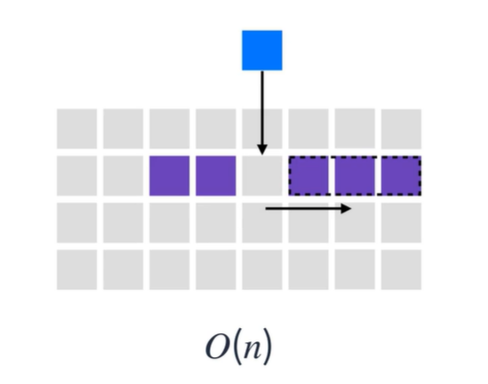
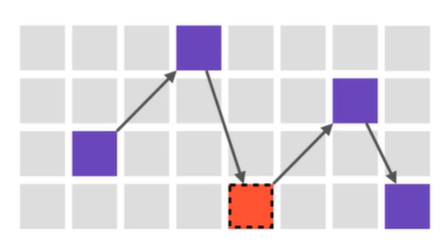
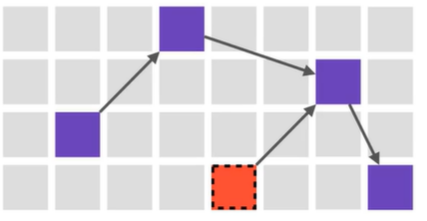
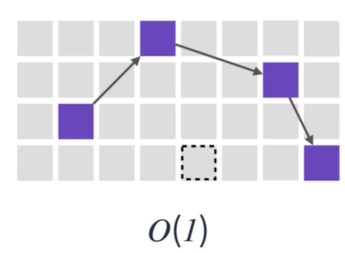
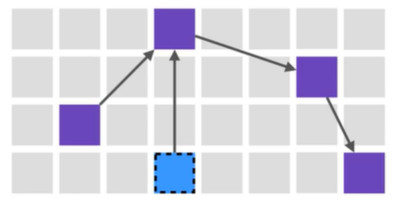
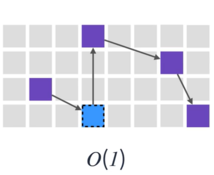

## 연결리스트

#### 추가 와 삭제가 반복되는 로직이라면 어떻게 해야될까???  
만약 배열을 사용하게 되면 시간복잡도가 증가하게된다.  
배열은 탐색이 많은 경우에 유리한 자료구조이다.  
  
#### 연결리스트
연결 리스트는 각 요소를 포인터로 연결하여 관리하는 선형 자료구조이다.  
각 요소는 노드라고 부르며 데이터 영역과 포인터 영역으로 구성된다.  
```
  HEAD(첫번째 노드)
   ---------        ---------    
   | A | ⚫ |  --->  |  B | ⚫ |
   ---------         ---------
                         /    
                      /
                    /
                  /
                ↙
   ---------          --------- 
  | C | ⚫  |    --->  | D | ⚫ |
   ---------          ---------

알파벳이 데이터 영역(해당 노드의 값)
동그라미(포인트영역) : 다음 노드를 가리킴

```

#### 특징
1. 메모리가 허용하는 한 요소를 제한없이 추가할 수 있다.
2. 탐색은 O(n)이 소요된다.
3. 요소를 추가하거나 제거할때는 O(1)이 소요된다,
4. Singly Linked(단일 연결) List, Doubly Linked List(이중연결), Circular Linked List(선형연결)가 존재한다.  

#### 배열과 차이점

1. 메모리 차이
     
2. 배열 요소 삭제(배열삭제하기 위해서는 선형시간이 소요): 삭제된 요소의 공백을 메꾸기위해 뒷요소를 앞으로 당겨야하기 때문이다.
     
3. 배열 요소 추가(배열삭제하기 위해서는 선형시간이 소요): 배열에 요소를 추가 하기위해 뒷 요소를 한칸씩 이동시켜야 하기때문이다.
     

#### 연결 리스트 요소 삭제  
1. 삭제할 요소를 선택  
   
2. 삭제할 요소의 이전 요소가 가리키는 포인터를 삭제할 요소의 다음 요소를 가리키게 한다.
  
3. 삭제할 요소를 완전히 제거  
     
배열과 다르게 추가 하거나 삭제할때 **상수**시간만 소요된다.  

#### 연결 리스트 요소 추가 
 1. 추가할 요소  
    
  2. 추가할 요소를 사이에 추가하기위해 추가할 요소를 추가할 요소 다음 요소를 가리키게한다. 끼어넣을 이전 영역의 요소가 추가할 요소를 가리키게 한다.  
      
