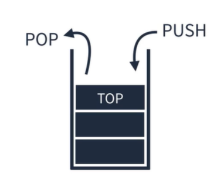
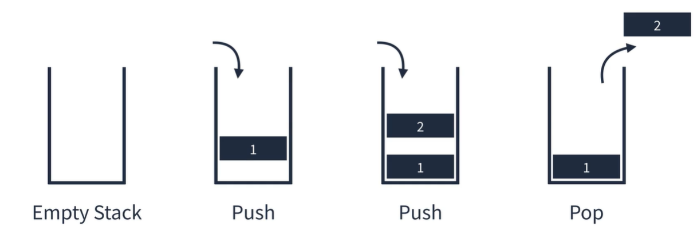
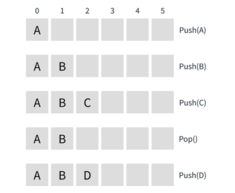
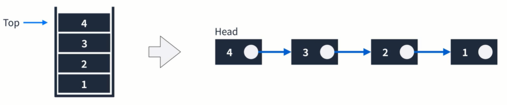

## Stack
Last in First Out 이라는 개념을 가진 선형 자료구조.  
바닥이 막힌 상자를 생각하면 편하다.  
더 이해하기 쉬운 걸로는 프링글스 과자통을 생각하면 된다.  

  

#### 스택의 동작원리
스택의 동작원리는 매우 간단하다.  
요소를 넣는 push 와 요소를 빼는 pop 만이 존재한다.  
  
  
스택 자료구조를 이용하는 가장 대표적인 것은 스택 메모리이다.  
  
#### 코드로 표현하는 Stack
1.Array로 표현하기  
Stack을 Array로 표현할 수 있다.  
  
  
2.Linked List로 표현하기  
Stack을 Linked List로 표현할 수 있다.  
  
