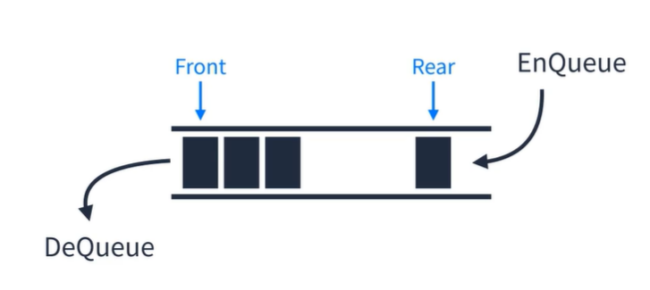
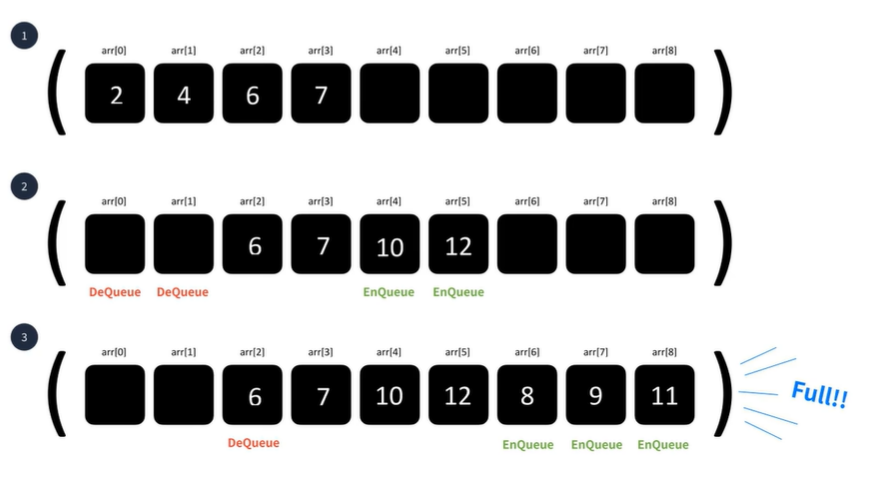
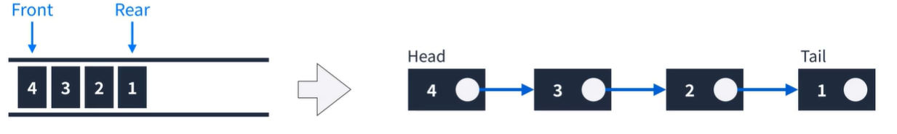
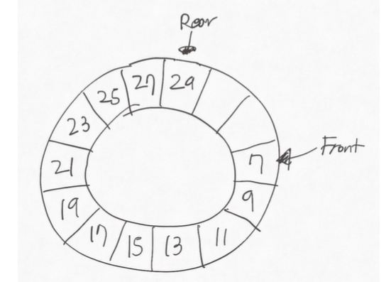

## Queue
First In First Out 이라는 개념을 가진 선형 자료구조다.  
Linear Queue 와 Circle Queue가 존재한다.  

  
  
#### 선형큐 (Linear Queue)
1. Array로 표현하기
Linear Queue를 Array로 표현할 수 있다.  

  
배열에서 EnQueue를 통해서 한정된 공간이 다차게 된다면 더이상 추가할 수 없다.  
하지만 Javascript 에서는 배열이 자유롭게 증감되기 때문에 이런 문제는 없겠지만  
Front나 Rear 인덱스 값이 **무한하게** 커질 수 있다는 문제가 있다.  
따라서 공간을 효율적을 사용하기 위해서 앞당기는 작업이 필요한데 이때 선형시간이 소요된다.  
  
2. Linked List로 표현하기  
Linear Queue를 Linked List로 표현할 수 있다.  
LinkedList로 구현하게 되면 Front 는 Head가 Rear는 Tail이 된다.  
LinkedList로 구현하게되면 배열과 다르게 인덱스에 대한 고민은 하지 않아도 된다.
  

     

3. Circular Queue
Front 와 Rear가 이어져있는 Queue  
Circular Queue는 Linked List로 구현했을때 이점이 없다.

   