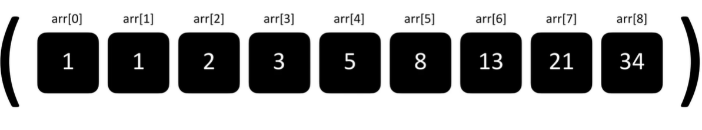
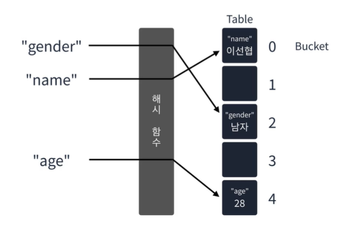
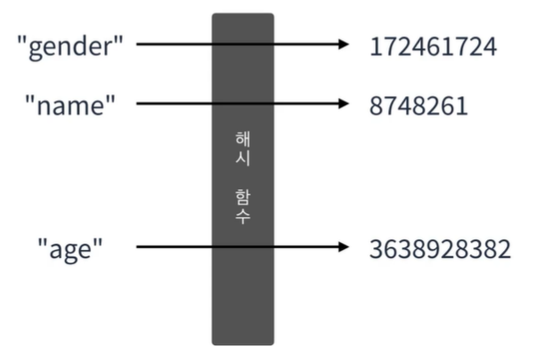
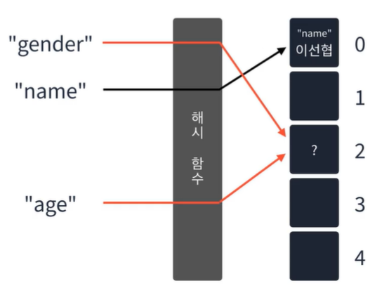
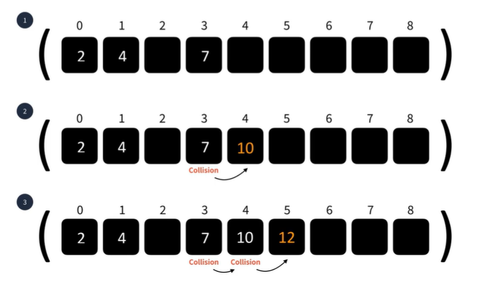
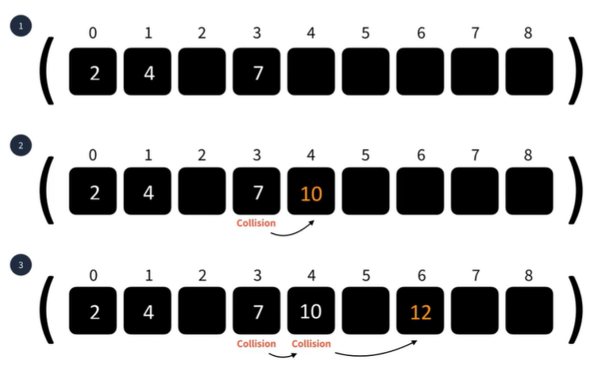
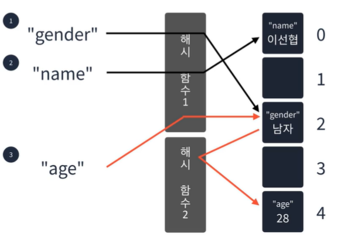
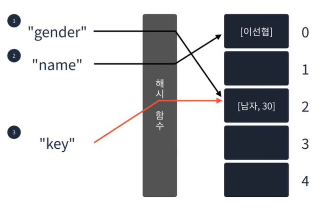

## HashTable
해시 테이블은 한정된 배열 공간에 key를 index로 변환하여 값을 넣게 된다.  
그럼 index는 어떻게 구할까???  
  
  
**해시테이블은** 키와 값을 받아 키를 해싱(Hashing)하여 나온 index에 값을 저장하는 선형구조이다.  
사입은 O(1)이며 키를 알고 있다면 삭제, 탐색도 O(1)로 수행한다.  
  
```
    해시테이블에 해시란?
    우리가 생각하는 해시브라운의 해시가 맞다.
    이 해시란 고기와 감자를 잘게 다져 요리한 것으로
    
    해시테이블에서 해시또한 입력받은 키를 잘게 잘라 숫자로 만든다는것이 비슷하다
```  
  
#### 해시 함수
입력받은 값을 특정 범위 내 숫자로 변경하는 함수  
  
  
#### 해시 테이블의 문제점  
만약 해시 함수의 결과가 동일하여 겹친다면??  
  
즉 해시함수의 결과가 동일한경우가 발생할 수 있다.  
이를 **해시충돌**이라고 한다.  
  
#### 해시 충돌을 해결하는 방법
1. 선형 탐사법 : 충돌이 발생하면 옆으로 한칸 이동한다.  
     
2. 제곱 탐사법: 충돌이 발생하면 충돌이 발생한 횟수의 제곱만큼 옆으로 이동한다.  
     
3. 이중 해싱: 충돌이 발생하면 다른 해시 함수를 이용한다.
     
4. 분리 연결법 : 버킷의 값을 연결 리스트로 사용하여 충돌이 발생하면 리스트에 값을 추가한다.
     
  
  


