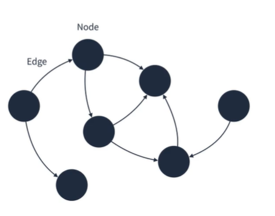
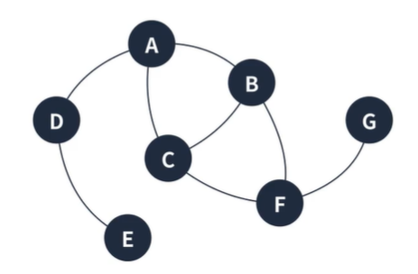
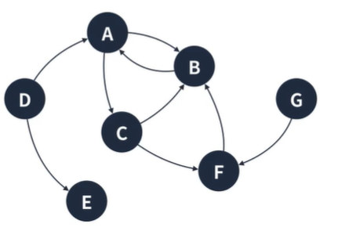
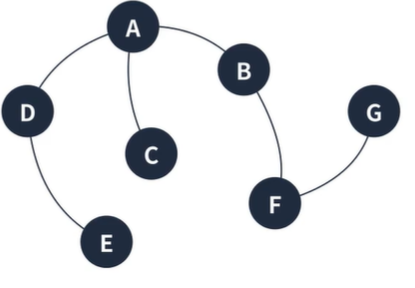
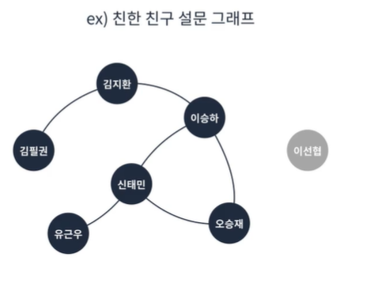
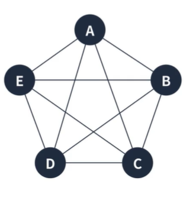
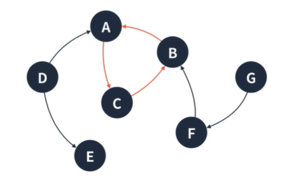
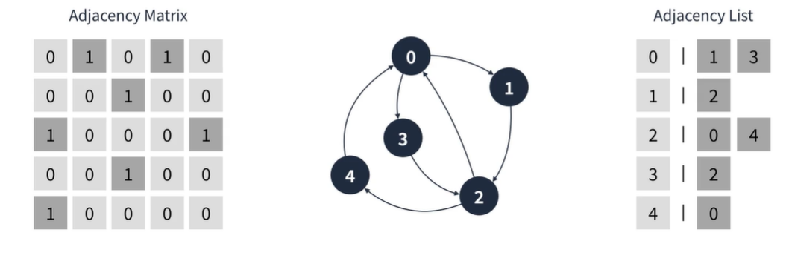

## 그래프
정점과 정점 사이를 연결하는 간선으로 이루어진 비선형 자료구조  
정점 집합과 간선 집합으로 표현할 수 있다.  
실제 사용 예제는 지하철 노선도 나 페이지 링크 알고리즘등 이있다.  
이때 각 정점이 지하철역이 되고 역과 역사이의 간선은 이동시간 정보를 가지고 있다.  
페이지링크 알고리즘은 검색 알고리즘으로 하나의 페이지가 정점이 되고 페에지에서 파생되는 링크들이 간선이 된다.  

  

#### 그래프의 특징
1. 정점은 여러 개의 간선을 가질 수 있다.
2. 크게 방향 그래프와 무방향 그래프로 나눌 수 있다.
3. 간선은 가중치를 가질 수 있다.
4. 사이클이 발생할 수 있다.  
  
#### 무방향 그래프
간선으로 이어진 정점끼리는 양방향으로 이동이 가능하다.  
표현하기에 (A,B) 와 (B,A)는 같은 간선으로 취급된다.  
ex) 양방향 통행 도로  
  
  
#### 방향 그래프
간선에 방향성이 존재하는 그래프  
양방향으로 갈 수 있더라도 <A,B> 와 <B,A>는 다른 간선으로 취급된다.  
ex)일반 통행  
  
  
#### 연결 그래프
모든 정점이 서로 이동 가능한 상태인 그래프  
  

#### 비연결 그래프
특정 정점쌍 사이에 간선이 존재하지 않는 그래프  
  

#### 완전 그래프
모든 정점끼리 연결된 상태인 그래프  
  

#### 사이클
그래프의 점점과 간선의 부분 집합에서 순환이 되는 부분  
  

  
#### 그래프의 구현 방법
인접 행렬, 인접 리스트 두가지 방식으로 그래프를 표현  
  
  
1. 인접행렬
```

// 1. 인접행렬
// 1. 연결이 안된 상태로 초기화
// 2. 행 렬의 열 부분을 시작 정점 행부분을 도착 정점
const graph = Array.from(Array(5), () => Array(5).fill(false));
console.log(graph);
graph[0][1] = true;
graph[0][3] = true;
graph[1][2] = true;
graph[2][0] = true;
graph[2][4] = true;
graph[3][2] = true;
graph[4][0] = true;
```  
  
2. 인접 리스트
```
const graph = Array.from(Array(5), () => []);
graph[0].push(1);
graph[0].push(3);
graph[1].push(2);
graph[2].push(0);
graph[2].push(4);
graph[3].push(2);
graph[4].push(0);
```


  


