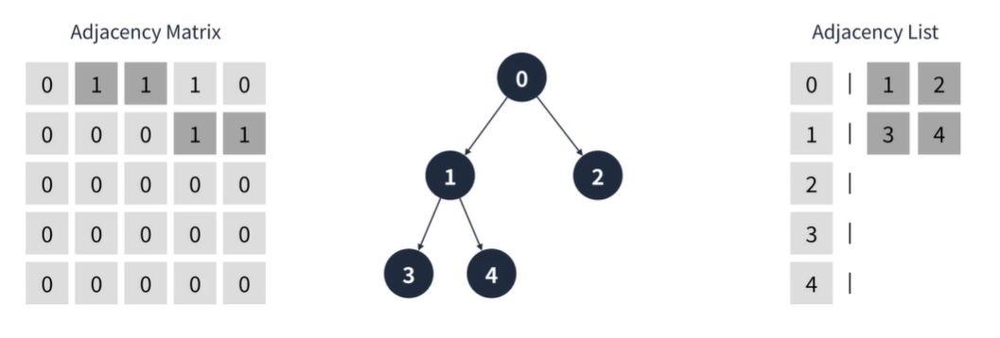

## 트리
방향 그래프의 일종으로 정점을 가리키는 간선이 하나 밖에 없는 구조를 가리킨다.  
Root: 가장 상위에 있는 정점  
Node: 각 정점들  
Leaf Node: 더이상 자식이 없는 노드  
Level: Root로 부터 몇번째 깊이 인지를 표현  
Degree(차수) : 한 정점에서 뻗어나가는 간선 수  
  
사용 예제) 조직도
  
  
#### 트리의 특징
1. 루트 정점을 제외한 모든 정점은 반드시 하나의 부모 정점을 가진다.
2. 정점이 N개인 트리는 반드시 N-1개의 간선을 가진다.
3. 루트에서 특정 정점으로 가는 경로는 유일하다.  

  
#### 이진트리
이진 트리는 각 정점이 최대 2개의 자식을 가지는 트리를 의미한다.  
탐색 알고리즘에서 많이 사용한다.  
완전 이진트리: 마지막 레벨을 제외하고 모든 정점이 채워져있는 트리  
포화 이진트리: 마지막 레벨까지 채워져있음  
현향트리 : 한 방향으로만 정점이 이어져있음
  
  
#### 이진 트리의 특징
1. 정점이 N개인 이진 트리는 최악의 경우 높이가 N이 될 수 있다.
2. 정점이 N개인 포화 또는 완전 이진 트리의 높이는 log N 이다.  
3. 높이가 n인 포화 이진 트리는 2ⁿ -1개의 정점을 가진다.
4. 일반적인 이진 트리를 사용하는 경우는 많지 않다. 다음 자료구조에 응용된다  
ex) 이진탐색트리, 힙, AVL 트리, 레드 블랙 트리  
  
#### 트리의 구현 방법
그래프와 마찬가지로 인접행렬, 인접 리스트 두 가지 방식으로 트리를 표현할 수 있다.  
  
#### 이진 트리의 구현 방법
배열 혹은 요소에 링크가 2개 존재하는 연결 리스트로 구현할 수 있다.  
  
