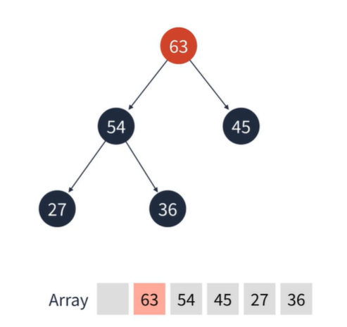

## Heap
**우선순위 큐:** FIFO인 큐와 달리 우선 순위가 높은 요소가 먼저 나가는 큐  
이때 우선순위 큐는 자료구조가 아닌 **개념**이다.  
이때 **힙**은 우선순위 큐를 구현하기위한 가장 적합한 방법이다.  
  
#### 힙
이진 트리 형태를 가지며 우선순위가 높은 요소가 먼저 나가기 위해  
요소가 삽입, 삭제 될때 바로 정렬되는 특징이 있다.  
가끔 우선순위 큐 와 힙이 같다고 생각하는데  
엄연히 다른 개념이다
  
  
#### 힙의 특징
1. 우선순위가 높은 요소가 먼저 나가는 특징을 가진다.
2. 루트가 가장 큰 값이 되는 최대 힙(Max Heap)과 루트가 가장 작은 값이 되는 최소 힙(Min Heap)이 있다.
3. 아쉽게도 자바스크립트에선 직접 구현해서 사용해야한다.
  
  
#### 힙 요소 추가 알고리즘
1. 요소가 추가될 때는 트리의 가장 마지막 정점에 위치한다.
2. 추가 후 부모 정점보다 우선순위가 높다면 부모 정점과 순서를 바꾼다.
3. 이 과정을 반복하면 결국 가장 우선순위가 높은 정점이 루트가 된다.
4. 와전 이진 트리의 높이는 log N 이기에 힙의 요소 추가 알고리즘은 O(log N) 시간복잡도를 가진다.  
  
Steap 1(최대힙에 45를 추가)  
  
  
Steap 2 (36을 추가)  

Steap 3 (54을 추가)  
  
  
최대 힙에서 45보다 54가 우선순위가 더 높다  
  
  
Steap 4(45와 54 정점을 바꾼다.)  
  

Steap 5(27을 추가)  
  

Steap 6(63을 추가)  
  
  
36 보다 63이 우선순위가 더 높다.  
  

Step 7(36과 63의 정점을 바꾼다)
  
  
54보다 63이 더 우선순위가 높다.  
  
  

Step 8(53 과 63 정점을 바꾼다)
  
  
**최대 힙 완성**  
  
  
#### 힙 요소 제거 알고리즘  
1. 요소 제거는 루트 정점만 가능하다.
2. 루트 정점이 제거된 후 가장 마지막 정점이 루트에 위치한다.
3. 루트 정점의 두 자식 정점 중 더 우선순위가 높은 정점과 바꾼다.
4. 두 자식 정점이 우선순위가 더 낮을 때 까지 반복한다.
5. 완전 이진 트리의 높이는 log N 이기에 힙의 요소 제거 알고리즘은  O(log N) 시간복잡도를 가진다.  
  
  
Steap 1(루트 정점 63을 제거한다.)  
  
  
Steap 2(가장 마지막 정점 36을 루트에 위치한다.)  
  
  
자식 정점 54와 45를 비교한다.  
  
  
Step 3(우선순위가 더 높은 54와 바꾼다)  
  
  
Step 4(자식 정점 27과 비교한다. 오른쪽 자식은 없기에 27하고만 비교한다.)  
  

자식 정점의 우선순위가 더 낮기에 바꾸지 않고 끝낸다.

  